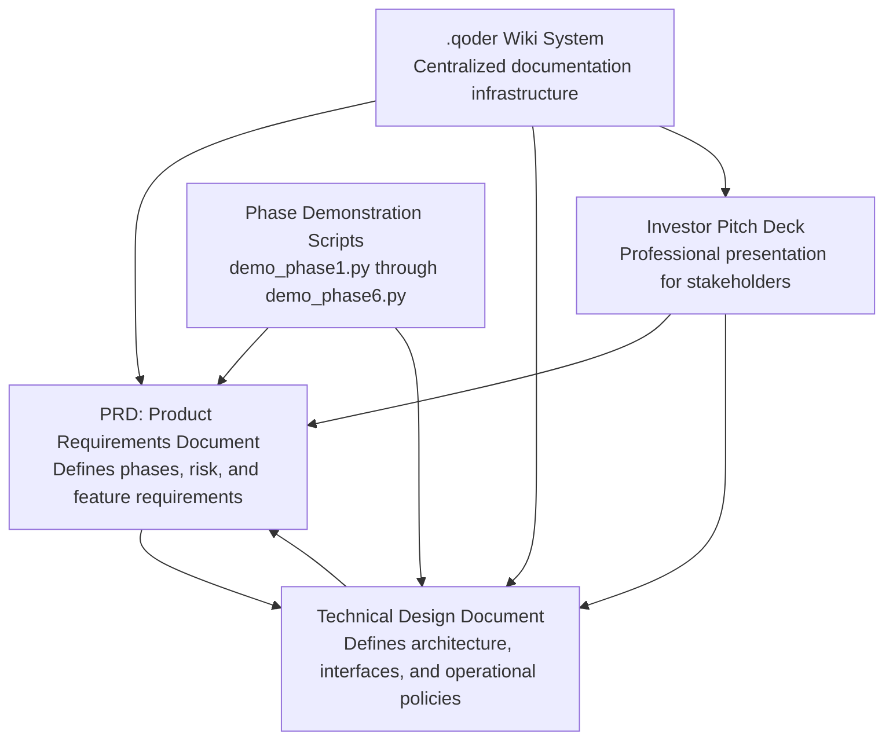
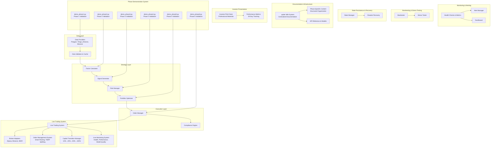
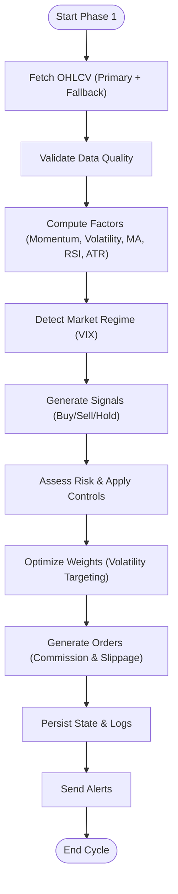
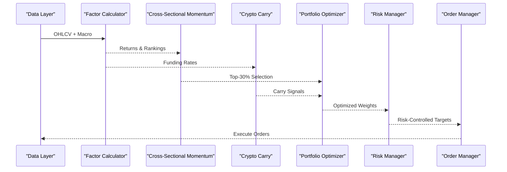
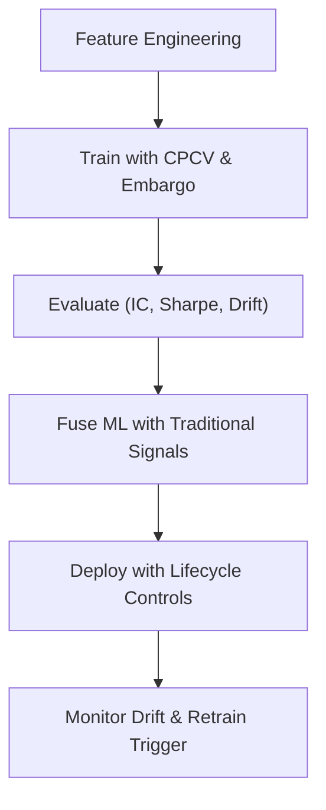
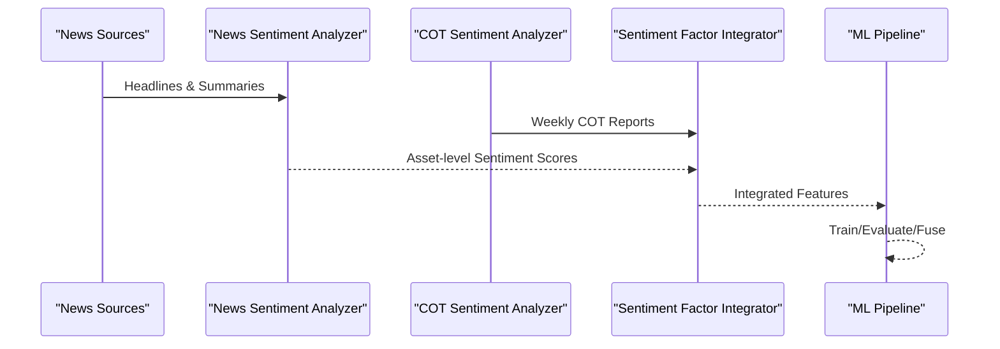
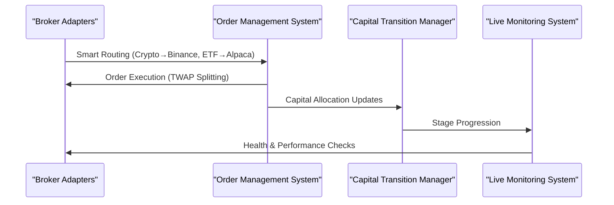
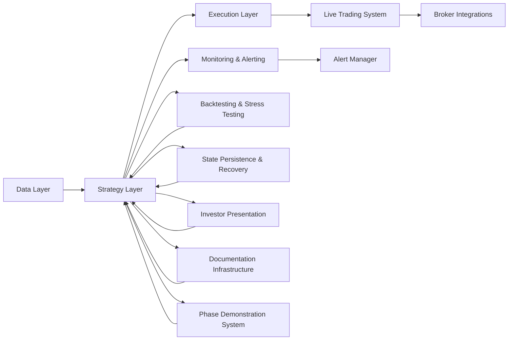

# Project Overview

<cite>
**Referenced Files in This Document**
- [README.md](file://README.md)
- [PRD_Intelligent_Trading_System_v2.md](file://PRD_Intelligent_Trading_System_v2.md)
- [Tech_Design_Document.md](file://Tech_Design_Document.md)
- [INVESTOR_PITCH.md](file://INVESTOR_PITCH.md)
- [PHASE1_COMPLETE.md](file://PHASE1_COMPLETE.md)
- [demo_phase1.py](file://demo_phase1.py)
- [demo_phase2.py](file://demo_phase2.py)
- [demo_phase3.py](file://demo_phase3.py)
- [demo_phase4.py](file://demo_phase4.py)
- [demo_phase5.py](file://demo_phase5.py)
- [demo_phase6.py](file://demo_phase6.py)
- [main.py](file://main.py)
- [src/live_trading/__init__.py](file://src/live_trading/__init__.py)
- [src/live_trading/brokers.py](file://src/live_trading/brokers.py)
- [src/live_trading/order_manager.py](file://src/live_trading/order_manager.py)
- [src/live_trading/transition.py](file://src/live_trading/transition.py)
- [src/live_trading/monitor.py](file://src/live_trading/monitor.py)
- [src/live_trading/models.py](file://src/live_trading/models.py)
- [.qoder/repowiki/en/content/Project Overview/System Introduction.md](file://.qoder/repowiki/en/content/Project Overview/System Introduction.md)
- [.qoder/repowiki/en/content/Project Overview/Key Capabilities.md](file://.qoder/repowiki/en/content/Project Overview/Key Capabilities.md)
</cite>

## Update Summary
**Changes Made**
- Updated system introduction to reflect Phase 6 COMPLETED status with full live trading implementation
- Enhanced key capabilities section to highlight Phase 6 achievements including broker integration, capital transition, and comprehensive monitoring
- Updated architecture overview to include live trading components as production-ready modules
- Revised demonstration capabilities to include Phase 6 live trading validation with special live mode support
- Enhanced system metrics to reflect completed Phase 6 implementation
- Updated phase documentation to reflect the completion of live trading system with comprehensive demo scripts
- Added detailed command examples for all six phases demonstrating practical usage

## Table of Contents
1. [Introduction](#introduction)
2. [Centralized Documentation Infrastructure](#centralized-documentation-infrastructure)
3. [Project Structure](#project-structure)
4. [Core Components](#core-components)
5. [Architecture Overview](#architecture-overview)
6. [Detailed Component Analysis](#detailed-component-analysis)
7. [Investor Presentation Capabilities](#investor-presentation-capabilities)
8. [Dependency Analysis](#dependency-analysis)
9. [Performance Considerations](#performance-considerations)
10. [Troubleshooting Guide](#troubleshooting-guide)
11. [Conclusion](#conclusion)
12. [Appendices](#appendices)

## Introduction
The Intelligent Trading Decision System is a production-ready multi-asset quantitative trading platform that has successfully completed Phase 6 with full live trading implementation. The system targets quant researchers and trading professionals who require a comprehensive, modular, and risk-aware framework with live trading capabilities. The platform now features:

- **Production-Ready Live Trading**: Complete broker integration with Alpaca (US ETFs), Binance (Crypto), and IBKR (Global markets)
- **Multi-asset coverage spanning 15+ asset classes**: Precious metals, equity ETFs, international ETFs, bonds, commodities, real estate, and cryptocurrency
- **Phased evolution from basic factor strategies to machine learning and NLP sentiment enhancement**
- **Hierarchical risk management with staged capital deployment and comprehensive monitoring**
- **Robust backtesting, stress testing, and compliance-aware operations**
- **Professional investor presentation capabilities with comprehensive English and Chinese documentation**
- **Comprehensive phase demonstration system with detailed command examples for all six phases**

**Enhanced** The system now operates as a fully functional production trading platform with live broker connectivity, automated order management, staged capital deployment, and comprehensive monitoring systems that meet enterprise-grade requirements. Each phase includes dedicated demo scripts with detailed command examples for validation and testing.

This overview balances conceptual explanations for newcomers and technical depth for developers, grounded in the repository's product and technical design documents, enhanced by professional presentation materials for stakeholder engagement and the new centralized documentation system.

## Centralized Documentation Infrastructure

**New** The Intelligent Trading Decision System now features a comprehensive .qoder wiki system that serves as the central hub for all project documentation. This infrastructure provides structured, phase-specific content organization and enhanced accessibility for diverse stakeholder groups.

### .qoder Wiki System Architecture

The .qoder system organizes documentation into a hierarchical structure that mirrors the project's six-phase evolution:

```mermaid
graph TB
subgraph ".qoder Wiki System"
QODER[".qoder/"]
REPOWIKI["repowiki/"]
EN["en/"]
CONTENT["content/"]
PROJECT_OVERVIEW["Project Overview/"]
SYSTEM_INTRODUCTION["System Introduction.md"]
KEY_CAPABILITIES["Key Capabilities.md"]
PHASE_DOCS["Phase Documentation/"]
PHASE1["Phase 1_ Basic Factor Strategies/"]
PHASE2["Phase 2_ Enhanced Multi-Asset Strategies/"]
PHASE3["Phase 3_ Machine Learning Enhancement/"]
PHASE4["Phase 4_ NLP Sentiment Analysis/"]
PHASE5["Phase 5_ Paper Trading System/"]
PHASE6["Phase 6_ Live Trading System/"]
API_REFERENCE["API Reference/"]
DATA_MODELS["Data Models and Structures/"]
END
```

**Diagram sources**
- [.qoder/repowiki/en/content/Project Overview/System Introduction.md](file://.qoder/repowiki/en/content/Project Overview/System Introduction.md#L1-L279)
- [.qoder/repowiki/en/content/Project Overview/Key Capabilities.md](file://.qoder/repowiki/en/content/Project Overview/Key Capabilities.md#L1-L377)

### Documentation Organization Structure

The .qoder system provides specialized documentation for different aspects of the trading system:

- **System Introduction**: High-level overview and executive summary
- **Key Capabilities**: Detailed feature descriptions and technical specifications
- **Phase Documentation**: Phase-specific implementation guides and strategy details
- **API Reference**: Technical interfaces and data models
- **Development Guidelines**: Coding standards and best practices

**Section sources**
- [.qoder/repowiki/en/content/Project Overview/System Introduction.md](file://.qoder/repowiki/en/content/Project Overview/System Introduction.md#L1-L279)
- [.qoder/repowiki/en/content/Project Overview/Key Capabilities.md](file://.qoder/repowiki/en/content/Project Overview/Key Capabilities.md#L1-L377)

## Project Structure
The repository centers on two primary documents supplemented by comprehensive investor presentation materials and enhanced by the new .qoder wiki system:

- **Product Requirements Document (PRD)**: Defines goals, phases, risk controls, and feature requirements.
- **Technical Design Document**: Outlines architecture, technology stack, module interfaces, and operational policies.
- **Investor Pitch Deck**: Professional presentation materials covering technology architecture, strategy phases, performance metrics, and funding requirements.
- **.qoder Wiki System**: Centralized documentation infrastructure with phase-specific content organization.
- **Phase Demonstration Scripts**: Comprehensive demo scripts for validating each phase implementation.

```mermaid
graph TB
PRD["PRD: Product Requirements Document<br/>Defines phases, risk, and feature requirements"]
TDD["Technical Design Document<br/>Defines architecture, interfaces, and operational policies"]
IPD["Investor Pitch Deck<br/>Professional presentation for stakeholders"]
WIKI[".qoder Wiki System<br/>Centralized documentation infrastructure"]
DEMOS["Phase Demonstration Scripts<br/>demo_phase1.py through demo_phase6.py"]
PRD --> TDD
TDD --> PRD
IPD --> PRD
IPD --> TDD
WIKI --> PRD
WIKI --> TDD
WIKI --> IPD
DEMOS --> PRD
DEMOS --> TDD
```

**Diagram sources**
- [PRD_Intelligent_Trading_System_v2.md](file://PRD_Intelligent_Trading_System_v2.md#L1-L1339)
- [Tech_Design_Document.md](file://Tech_Design_Document.md#L1-L1502)
- [INVESTOR_PITCH.md](file://INVESTOR_PITCH.md#L1-L242)
- [.qoder/repowiki/en/content/Project Overview/System Introduction.md](file://.qoder/repowiki/en/content/Project Overview/System Introduction.md#L37-L46)

**Section sources**
- [PRD_Intelligent_Trading_System_v2.md](file://PRD_Intelligent_Trading_System_v2.md#L1-L1339)
- [Tech_Design_Document.md](file://Tech_Design_Document.md#L1-L1502)
- [INVESTOR_PITCH.md](file://INVESTOR_PITCH.md#L1-L242)
- [.qoder/repowiki/en/content/Project Overview/System Introduction.md](file://.qoder/repowiki/en/content/Project Overview/System Introduction.md#L32-L51)

## Core Components
The system is organized around a layered architecture with clear separation of concerns, enhanced by the centralized documentation infrastructure:

- **Data Layer**: Multi-source ingestion, validation, caching, and persistence.
- **Strategy Layer**: Factor computation, signal generation, risk management, and portfolio optimization.
- **Execution Layer**: Order management, broker routing, and compliance enforcement.
- **Monitoring & Alerting**: Health checks, metrics, alerts, and dashboards.
- **Backtesting & Stress Testing**: Historical validation and scenario testing.
- **State Persistence & Disaster Recovery**: Portfolio state, trade logs, and recovery procedures.
- **Live Trading System**: Production-ready broker integration, order management, capital transition, and monitoring.
- **Documentation Infrastructure**: Centralized .qoder wiki system with phase-specific content organization.
- **Phase Demonstration System**: Comprehensive demo scripts for validating each phase implementation.

Key capabilities include:
- **Production-Ready Live Trading**: Complete broker integration with Alpaca, Binance, and IBKR
- **15+ asset class coverage** enabling statistically meaningful cross-sectional signals.
- **Hierarchical risk management** with progressive controls and correlation monitoring.
- **Staged Capital Deployment** with 10%→25%→50%→100% rollout and rollback triggers
- **Comprehensive Monitoring Systems** with health checks, performance tracking, and model quality monitoring
- **Smart Order Routing** with asset-based broker selection and TWAP splitting
- **Production-ready architecture** with containerization, observability, and compliance safeguards.
- **Phased evolution** from basic factor strategies to ML and NLP sentiment.
- **Professional investor presentation materials** in both English and Chinese.
- **Comprehensive performance tracking** and reporting capabilities.
- **Enhanced** Centralized documentation infrastructure with structured phase-specific content for improved accessibility and maintainability.
- **Comprehensive Phase Demonstration System** with detailed command examples for validating each phase implementation.

**Section sources**
- [PRD_Intelligent_Trading_System_v2.md](file://PRD_Intelligent_Trading_System_v2.md#L44-L73)
- [Tech_Design_Document.md](file://Tech_Design_Document.md#L34-L117)
- [INVESTOR_PITCH.md](file://INVESTOR_PITCH.md#L82-L120)
- [.qoder/repowiki/en/content/Project Overview/Key Capabilities.md](file://.qoder/repowiki/en/content/Project Overview/Key Capabilities.md#L83-L91)

## Architecture Overview
The system follows a modular, microservices-like structure with distinct layers and clear data flow, enhanced by the centralized documentation infrastructure:

```mermaid
graph TB
subgraph "Data Layer"
DS["Data Providers<br/>Polygon, Tiingo, yfinance, Binance"]
DV["Data Validator & Cache"]
end
subgraph "Strategy Layer"
FC["Factor Calculator"]
SG["Signal Generator"]
RM["Risk Manager"]
PO["Portfolio Optimizer"]
end
subgraph "Execution Layer"
OM["Order Manager"]
CE["Compliance Engine"]
end
subgraph "Live Trading System"
LTS["Live Trading System"]
BA["Broker Adapters<br/>Alpaca, Binance, IBKR"]
OMS["Order Management System<br/>Smart Routing, TWAP Splitting"]
CTM["Capital Transition Manager<br/>10%→25%→50%→100%"]
LMS["Live Monitoring System<br/>Health, Performance, Model Quality"]
end
subgraph "Monitoring & Alerting"
MON["Health Checks & Metrics"]
AL["Alert Manager"]
DB["Dashboard"]
end
subgraph "Backtesting & Stress Testing"
BT["Backtester"]
ST["Stress Tester"]
end
subgraph "State Persistence & Recovery"
SM["State Manager"]
DR["Disaster Recovery"]
end
subgraph "Documentation Infrastructure"
WIKI[".qoder Wiki System<br/>Centralized Documentation"]
DOC["Phase-Specific Content<br/>Structured Organization"]
API["API Reference & Models"]
end
subgraph "Investor Presentation"
IP["Investor Pitch Deck<br/>Professional Materials"]
PM["Performance Metrics<br/>30-Day Tracking"]
end
subgraph "Phase Demonstration System"
DEMOPHASE1["demo_phase1.py<br/>Phase 1 Validation"]
DEMOPHASE2["demo_phase2.py<br/>Phase 2 Validation"]
DEMOPHASE3["demo_phase3.py<br/>Phase 3 Validation"]
DEMOPHASE4["demo_phase4.py<br/>Phase 4 Validation"]
DEMOPHASE5["demo_phase5.py<br/>Phase 5 Validation"]
DEMOPHASE6["demo_phase6.py<br/>Phase 6 Validation"]
end
DS --> DV
DV --> FC
FC --> SG
SG --> RM
RM --> PO
PO --> OM
OM --> LTS
LTS --> BA
LTS --> OMS
LTS --> CTM
LTS --> LMS
OM --> CE
MON --> AL
MON --> DB
BT --> ST
SM --> DR
WIKI --> DOC
WIKI --> API
IP --> PM
DEMOPHASE1 --> DS
DEMOPHASE2 --> FC
DEMOPHASE3 --> SG
DEMOPHASE4 --> RM
DEMOPHASE5 --> PO
DEMOPHASE6 --> OM
```

**Diagram sources**
- [Tech_Design_Document.md](file://Tech_Design_Document.md#L38-L117)
- [PRD_Intelligent_Trading_System_v2.md](file://PRD_Intelligent_Trading_System_v2.md#L129-L417)
- [INVESTOR_PITCH.md](file://INVESTOR_PITCH.md#L20-L120)
- [.qoder/repowiki/en/content/Project Overview/System Introduction.md](file://.qoder/repowiki/en/content/Project Overview/System Introduction.md#L75-L118)

**Section sources**
- [Tech_Design_Document.md](file://Tech_Design_Document.md#L34-L117)
- [PRD_Intelligent_Trading_System_v2.md](file://PRD_Intelligent_Trading_System_v2.md#L129-L417)
- [INVESTOR_PITCH.md](file://INVESTOR_PITCH.md#L20-L120)
- [.qoder/repowiki/en/content/Project Overview/System Introduction.md](file://.qoder/repowiki/en/content/Project Overview/System Introduction.md#L72-L122)

## Detailed Component Analysis

### Phase 1: Basic Factor Strategies (MVP)
Goal: Establish a runnable system that generates clear buy/sell signals across core assets.

Capabilities:
- Data acquisition with multi-source fallback and quality validation.
- Factor computation (momentum, volatility, moving averages, RSI, ATR).
- Signal generation with market regime filtering (VIX-based).
- Position sizing constrained by volatility targeting and risk budgets.
- Transaction cost modeling and order generation.
- Hierarchical risk controls with progressive de-risking and correlation monitoring.
- Backtesting and stress testing across historical crises.
- State persistence and alerting.
- **Enhanced** Comprehensive documentation in the .qoder wiki system with detailed implementation guides and troubleshooting resources.
- **Enhanced** Dedicated demo script (demo_phase1.py) with detailed validation commands and examples.

Practical example (conceptual):
- Input: OHLCV series for GLD, SPY, QQQ, BTC-USD.
- Output: Trade signals with confidence and target weights, plus reasons and regime classification.

```mermaid
flowchart TD
Start(["Start Phase 1"]) --> Fetch["Fetch OHLCV (Primary + Fallback)"]
Fetch --> Validate["Validate Data Quality"]
Validate --> Factors["Compute Factors (Momentum, Volatility, MA, RSI, ATR)"]
Factors --> Regime["Detect Market Regime (VIX)"]
Regime --> Signals["Generate Signals (Buy/Sell/Hold)"]
Signals --> Risk["Assess Risk & Apply Controls"]
Risk --> Optimize["Optimize Weights (Volatility Targeting)"]
Optimize --> Orders["Generate Orders (Commission & Slippage)"]
Orders --> Persist["Persist State & Logs"]
Persist --> Alerts["Send Alerts"]
Alerts --> End(["End Cycle"])
```

**Diagram sources**
- [PRD_Intelligent_Trading_System_v2.md](file://PRD_Intelligent_Trading_System_v2.md#L131-L417)
- [Tech_Design_Document.md](file://Tech_Design_Document.md#L209-L437)

**Section sources**
- [PRD_Intelligent_Trading_System_v2.md](file://PRD_Intelligent_Trading_System_v2.md#L131-L417)
- [Tech_Design_Document.md](file://Tech_Design_Document.md#L209-L437)
- [.qoder/repowiki/en/content/Project Overview/System Introduction.md](file://.qoder/repowiki/en/content/Project Overview/System Introduction.md#L125-L144)

### Phase 2: Cross-Sectional Momentum & Carry Strategies
Goal: Expand to 15 assets and introduce cross-sectional selection and crypto carry.

Capabilities:
- Cross-sectional momentum ranking across 15 assets with trend filters.
- Crypto carry strategy using funding rates for BTC perpetuals.
- Tactical asset allocation combining momentum ranking with risk parity optimization.
- Enhanced correlation monitoring and re-entry logic after risk events.
- **Enhanced** Phase-specific documentation with detailed implementation guidelines and performance metrics.
- **Enhanced** Dedicated demo script (demo_phase2.py) with comprehensive validation commands.

Practical example (conceptual):
- Input: 15-asset returns and macro features.
- Output: Long-only top-performing assets, carry positions, and optimized monthly weights.

```mermaid
sequenceDiagram
participant Data as "Data Layer"
participant Factor as "Factor Calculator"
participant Momentum as "Cross-Sectional Momentum"
participant Carry as "Crypto Carry"
participant Optimize as "Portfolio Optimizer"
participant Risk as "Risk Manager"
participant Orders as "Order Manager"
Data->>Factor : OHLCV + Macro
Factor-->>Momentum : Returns & Rankings
Factor-->>Carry : Funding Rates
Momentum-->>Optimize : Top-30% Selection
Carry-->>Optimize : Carry Signals
Optimize-->>Risk : Optimized Weights
Risk-->>Orders : Risk-Controlled Targets
Orders-->>Data : Execute Orders
```

**Diagram sources**
- [PRD_Intelligent_Trading_System_v2.md](file://PRD_Intelligent_Trading_System_v2.md#L459-L567)
- [Tech_Design_Document.md](file://Tech_Design_Document.md#L575-L678)

**Section sources**
- [PRD_Intelligent_Trading_System_v2.md](file://PRD_Intelligent_Trading_System_v2.md#L459-L567)
- [Tech_Design_Document.md](file://Tech_Design_Document.md#L575-L678)
- [.qoder/repowiki/en/content/Project Overview/System Introduction.md](file://.qoder/repowiki/en/content/Project Overview/System Introduction.md#L145-L163)

### Phase 3: Machine Learning Enhancement
Goal: Introduce ML models to improve signal quality and robustness.

Capabilities:
- Robust feature engineering with point-in-time constraints and macro features.
- Overfitting-resistant training using combinatorial purged cross-validation and embargo.
- Model fusion combining traditional signals with ML predictions.
- Model lifecycle management including retraining schedules and concept drift detection.
- **Enhanced** Comprehensive ML documentation with validation frameworks and model lifecycle management guidelines.
- **Enhanced** Dedicated demo script (demo_phase3.py) with detailed ML pipeline validation commands.

**Updated** Corrected overfitting detection threshold parameters for enhanced model robustness

Practical example (conceptual):
- Input: Historical features (technical + macro + cross-sectional).
- Output: Predictions fused with traditional signals, with dynamic weighting based on rolling IC.

```mermaid
flowchart TD
FE["Feature Engineering"] --> Train["Train with CPCV & Embargo"]
Train --> Evaluate["Evaluate (IC, Sharpe, Drift)"]
Evaluate --> Fuse["Fuse ML with Traditional Signals"]
Fuse --> Deploy["Deploy with Lifecycle Controls"]
Deploy --> Monitor["Monitor Drift & Retrain Trigger"]
```

**Diagram sources**
- [PRD_Intelligent_Trading_System_v2.md](file://PRD_Intelligent_Trading_System_v2.md#L571-L721)
- [Tech_Design_Document.md](file://Tech_Design_Document.md#L473-L573)

**Section sources**
- [PRD_Intelligent_Trading_System_v2.md](file://PRD_Intelligent_Trading_System_v2.md#L571-L721)
- [Tech_Design_Document.md](file://Tech_Design_Document.md#L473-L573)
- [.qoder/repowiki/en/content/Project Overview/System Introduction.md](file://.qoder/repowiki/en/content/Project Overview/System Introduction.md#L164-L182)

### Phase 4: NLP Sentiment Integration
Goal: Incorporate textual sentiment as an input feature to ML models.

Capabilities:
- News sentiment analysis using FinBERT on headline-level text.
- COT-based retail sentiment as a contrarian indicator.
- Integration into ML feature sets with SHAP-based interpretability checks.
- **Enhanced** NLP-specific documentation with sentiment analysis frameworks and integration guidelines.
- **Enhanced** Dedicated demo script (demo_phase4.py) with comprehensive NLP validation commands.

Practical example (conceptual):
- Input: Daily news headlines and COT reports.
- Output: Sentiment scores and momentum features integrated into ML pipelines.

```mermaid
sequenceDiagram
participant News as "News Sources"
participant NLP as "News Sentiment Analyzer"
participant COT as "COT Sentiment Analyzer"
participant Integrate as "Sentiment Factor Integrator"
participant ML as "ML Pipeline"
News->>NLP : Headlines & Summaries
COT->>Integrate : Weekly COT Reports
NLP-->>Integrate : Asset-level Sentiment Scores
Integrate-->>ML : Integrated Features
ML-->>ML : Train/Evaluate/Fuse
```

**Diagram sources**
- [PRD_Intelligent_Trading_System_v2.md](file://PRD_Intelligent_Trading_System_v2.md#L724-L800)
- [Tech_Design_Document.md](file://Tech_Design_Document.md#L680-L769)

**Section sources**
- [PRD_Intelligent_Trading_System_v2.md](file://PRD_Intelligent_Trading_System_v2.md#L724-L800)
- [Tech_Design_Document.md](file://Tech_Design_Document.md#L680-L769)
- [.qoder/repowiki/en/content/Project Overview/System Introduction.md](file://.qoder/repowiki/en/content/Project Overview/System Introduction.md#L183-L200)

### Phase 5: Paper Trading System (Complete)
Goal: Validate strategies in live market conditions before capital deployment.

Capabilities:
- Realistic order execution simulation with slippage, delays, and partial fills.
- Real-time performance tracking with rolling Sharpe ratios, IC, and KS statistics.
- Gate validation system for paper-to-live transition.
- Deviation analysis comparing paper performance to backtest results.
- **Enhanced** Comprehensive paper trading documentation with validation frameworks.
- **Enhanced** Dedicated demo script (demo_phase5.py) with detailed paper trading validation commands.

**Section sources**
- [INVESTOR_PITCH.md](file://INVESTOR_PITCH.md#L82-L108)
- [PRD_Intelligent_Trading_System_v2.md](file://PRD_Intelligent_Trading_System_v2.md#L802-L880)

### Phase 6: Live Trading System (Complete)
Goal: Implement production-ready live trading with broker integration and comprehensive monitoring.

**Updated** Phase 6 now shows COMPLETED status with full live trading implementation

Capabilities:
- **Broker API Integration**: Alpaca (US ETFs), Binance (Crypto), IBKR (Global markets)
- **Account Information & Positions**: Real-time account balance, buying power, positions
- **Smart Order Management**: Asset-based broker selection, TWAP splitting, retry logic
- **Staged Capital Deployment**: 10%→25%→50%→100% rollout with rollback triggers
- **Comprehensive Monitoring**: System health, performance tracking, model quality monitoring
- **Production-Ready Architecture**: Enterprise-grade broker connectivity and order management
- **Enhanced** Complete implementation with end-to-end validation and production deployment readiness
- **Enhanced** Dedicated demo script (demo_phase6.py) with comprehensive live trading validation commands and special live mode support

**Updated** Added special note about live mode support for demo_phase6.py with detailed command examples

```mermaid
sequenceDiagram
participant Broker as "Broker Adapters"
participant OMS as "Order Management System"
participant CTM as "Capital Transition Manager"
participant Monitor as "Live Monitoring System"
Broker->>OMS : Smart Routing (Crypto→Binance, ETF→Alpaca)
OMS->>Broker : Order Execution (TWAP Splitting)
OMS->>CTM : Capital Allocation Updates
CTM->>Monitor : Stage Progression
Monitor->>Broker : Health & Performance Checks
```

**Diagram sources**
- [src/live_trading/brokers.py](file://src/live_trading/brokers.py#L1-L656)
- [src/live_trading/order_manager.py](file://src/live_trading/order_manager.py#L1-L210)
- [src/live_trading/transition.py](file://src/live_trading/transition.py#L1-L292)
- [src/live_trading/monitor.py](file://src/live_trading/monitor.py#L1-L136)

**Section sources**
- [README.md](file://README.md#L70-L82)
- [demo_phase6.py](file://demo_phase6.py#L1-L426)
- [src/live_trading/__init__.py](file://src/live_trading/__init__.py#L1-L77)
- [src/live_trading/brokers.py](file://src/live_trading/brokers.py#L1-L656)
- [src/live_trading/order_manager.py](file://src/live_trading/order_manager.py#L1-L210)
- [src/live_trading/transition.py](file://src/live_trading/transition.py#L1-L292)
- [src/live_trading/monitor.py](file://src/live_trading/monitor.py#L1-L136)

### Modular Architecture and Technology Stack
- **Programming language**: Python 3.12+.
- **Data processing**: pandas, numpy.
- **Technical analysis**: pandas-ta.
- **Backtesting**: Backtrader.
- **Portfolio optimization**: riskfolio-lib.
- **Machine learning**: scikit-learn, XGBoost, LightGBM.
- **NLP**: transformers (FinBERT).
- **Live Trading**: aiohttp, certifi, psutil.
- **Visualization**: matplotlib, plotly.
- **Configuration**: pydantic, yaml.
- **Logging**: loguru.
- **Alerts**: apprise.
- **Testing**: pytest.
- **Infrastructure**: Docker, cron/Airflow, Prometheus/Grafana, SQLite/PostgreSQL, AWS EC2.
- **Presentation**: Markdown for professional documentation.
- **Documentation**: .qoder wiki system for centralized, phase-specific content organization.
- **Phase Demonstration**: Comprehensive demo scripts for validating each phase implementation.

**Section sources**
- [Tech_Design_Document.md](file://Tech_Design_Document.md#L121-L160)
- [PRD_Intelligent_Trading_System_v2.md](file://PRD_Intelligent_Trading_System_v2.md#L108-L126)
- [INVESTOR_PITCH.md](file://INVESTOR_PITCH.md#L1-L242)
- [.qoder/repowiki/en/content/Project Overview/Key Capabilities.md](file://.qoder/repowiki/en/content/Project Overview/Key Capabilities.md#L199-L203)

### Integration Patterns
- Multi-source data providers with automatic fallback and quality validation.
- Factor calculators feeding into signal generators and risk managers.
- Risk manager coordinating with portfolio optimizer and order manager.
- State manager persisting portfolio and trade logs for recovery.
- Alert manager broadcasting via Slack, Email, Telegram.
- Backtester and stress tester validating performance under adverse scenarios.
- Professional presentation system integrating with performance tracking.
- **Enhanced** .qoder wiki system providing centralized integration documentation and troubleshooting resources.
- **Enhanced** Live trading system providing production-ready broker integration and monitoring.
- **Enhanced** Comprehensive phase demonstration system providing detailed validation commands for each phase.

**Section sources**
- [Tech_Design_Document.md](file://Tech_Design_Document.md#L209-L437)
- [PRD_Intelligent_Trading_System_v2.md](file://PRD_Intelligent_Trading_System_v2.md#L334-L417)
- [.qoder/repowiki/en/content/Project Overview/System Introduction.md](file://.qoder/repowiki/en/content/Project Overview/System Introduction.md#L215-L237)

## Investor Presentation Capabilities
The system includes comprehensive investor presentation materials designed to engage stakeholders and communicate technical achievements effectively, enhanced by the centralized documentation infrastructure:

### Professional Documentation Suite
- **Multi-Language Support**: Complete English and Chinese versions of the investor pitch deck.
- **Technology Architecture**: Detailed technical specifications presented in accessible formats.
- **Strategy Phases**: Clear documentation of the six-phase evolution from MVP to live trading.
- **Performance Metrics**: Real-time tracking of recent performance with benchmark comparisons.
- **Funding Requirements**: Transparent documentation of seed/angel funding needs and use of funds.
- **Enhanced** Centralized documentation system providing structured, phase-specific content for improved stakeholder accessibility.
- **Enhanced** Comprehensive phase demonstration system providing detailed validation commands for each phase.

### Key Presentation Elements
- **Investment Thesis**: Six core advantages including risk-adjusted returns, downside protection, adaptive strategy, alternative alpha, production-ready implementation, and comprehensive monitoring.
- **Phase Roadmap**: Complete documentation of technology architecture and strategy evolution through six phases.
- **Performance Tracking**: Last 30 days performance metrics with asset-by-asset breakdown.
- **Risk Management**: 4-level hierarchical controls with concrete thresholds and triggers.
- **Cost Efficiency**: Emphasis on mostly free data sources and cost-effective infrastructure.
- **Enhanced** Structured documentation organization facilitating easy navigation and comprehension.
- **Enhanced** Comprehensive demo system providing practical validation examples for each phase.

### Stakeholder Communication
- **Executive Summary**: Concise overview of the Shark Quant Trader platform.
- **Technical Details**: Implementation specifics for each phase with concrete metrics.
- **Business Case**: Clear rationale for investment with measurable outcomes.
- **Future Vision**: Roadmap for continued development and expansion.
- **Enhanced** Centralized documentation system supporting ongoing stakeholder engagement and education.
- **Enhanced** Comprehensive phase demonstration system providing practical validation examples for each phase.

**Section sources**
- [INVESTOR_PITCH.md](file://INVESTOR_PITCH.md#L1-L242)
- [.qoder/repowiki/en/content/Project Overview/Key Capabilities.md](file://.qoder/repowiki/en/content/Project Overview/Key Capabilities.md#L21-L30)

## Dependency Analysis
The system exhibits strong cohesion within layers and explicit interfaces between modules, enhanced by the centralized documentation infrastructure. Dependencies are primarily functional (layer-to-layer) rather than cyclic, with clear extension points for strategies, data sources, and brokers.

```mermaid
graph LR
Data["Data Layer"] --> Strategy["Strategy Layer"]
Strategy --> Execution["Execution Layer"]
Strategy --> Monitoring["Monitoring & Alerting"]
Strategy --> Backtest["Backtesting & Stress Testing"]
Strategy --> State["State Persistence & Recovery"]
Strategy --> Presentation["Investor Presentation"]
Strategy --> Documentation["Documentation Infrastructure"]
Strategy --> Demos["Phase Demonstration System"]
Execution --> LiveTrading["Live Trading System"]
LiveTrading --> Broker["Broker Integrations"]
Monitoring --> Alerts["Alert Manager"]
Backtest --> Strategy
State --> Strategy
Presentation --> Strategy
Documentation --> Strategy
Demos --> Strategy
```

**Diagram sources**
- [Tech_Design_Document.md](file://Tech_Design_Document.md#L38-L117)
- [.qoder/repowiki/en/content/Project Overview/System Introduction.md](file://.qoder/repowiki/en/content/Project Overview/System Introduction.md#L215-L237)

**Section sources**
- [Tech_Design_Document.md](file://Tech_Design_Document.md#L38-L117)
- [.qoder/repowiki/en/content/Project Overview/System Introduction.md](file://.qoder/repowiki/en/content/Project Overview/System Introduction.md#L215-L237)

## Performance Considerations
- Strategy performance targets include Sharpe ratio, max drawdown, win rate, and turnover constraints.
- System performance targets include signal latency, backtest speed, memory usage, recovery time, and data refresh windows.
- Scalability considerations include horizontal scaling, microservices decomposition, message queues, and caching layers.
- Investor presentation performance includes real-time data updates and multi-language content synchronization.
- **Enhanced** Documentation system performance including real-time content updates and centralized access for improved stakeholder engagement.
- **Enhanced** Live trading system performance with broker API latency monitoring and order execution reliability.
- **Enhanced** Phase demonstration system performance with comprehensive validation commands and examples.

**Section sources**
- [Tech_Design_Document.md](file://Tech_Design_Document.md#L1075-L1111)
- [PRD_Intelligent_Trading_System_v2.md](file://PRD_Intelligent_Trading_System_v2.md#L334-L362)
- [INVESTOR_PITCH.md](file://INVESTOR_PITCH.md#L82-L120)
- [.qoder/repowiki/en/content/Project Overview/Key Capabilities.md](file://.qoder/repowiki/en/content/Project Overview/Key Capabilities.md#L345-L349)

## Troubleshooting Guide
Common areas to investigate:
- Data quality issues: Validate missing data thresholds, cross-source deviations, and price jump detection.
- Risk control escalations: Confirm risk level assessments, correlation breaches, and re-entry conditions.
- Model lifecycle: Verify retraining triggers, concept drift detection, and model retirement criteria.
- State persistence: Ensure state saves and loads correctly, and that recovery reconciles with broker positions.
- Alerts: Confirm multi-channel delivery and escalation rules.
- Investor presentation: Verify content synchronization and multi-language display consistency.
- **Enhanced** Documentation system: Verify .qoder wiki content organization, phase-specific documentation access, and centralized resource availability.
- **Enhanced** Live trading system: Verify broker connectivity, order routing accuracy, capital transition triggers, and monitoring system health.
- **Enhanced** Phase demonstration system: Verify demo script execution, validation commands, and comprehensive phase validation.

**Section sources**
- [Tech_Design_Document.md](file://Tech_Design_Document.md#L835-L888)
- [PRD_Intelligent_Trading_System_v2.md](file://PRD_Intelligent_Trading_System_v2.md#L288-L417)
- [.qoder/repowiki/en/content/Project Overview/Key Capabilities.md](file://.qoder/repowiki/en/content/Project Overview/Key Capabilities.md#L352-L358)

## Conclusion
The Intelligent Trading Decision System provides a pragmatic, production-grade framework for multi-asset quantitative trading. Its phased evolution—from basic factor strategies to ML and NLP—ensures robustness, interpretability, and scalability. The modular architecture, comprehensive risk controls, and rigorous backtesting/stress testing make it suitable for both research and operational use.

**Enhanced** The completion of Phase 6 transforms the system into a fully functional production trading platform with live broker integration, automated order management, staged capital deployment, and comprehensive monitoring systems. The addition of the centralized .qoder wiki documentation system significantly improves stakeholder engagement, communication capabilities, and documentation accessibility. The structured, phase-specific content organization makes the platform more approachable for both technical development and business growth, while the comprehensive documentation infrastructure supports ongoing maintenance, enhancement, and knowledge transfer.

**Enhanced** The comprehensive phase demonstration system with detailed command examples for all six phases provides practical validation tools for stakeholders and developers, ensuring transparency and confidence in the system's capabilities across all evolutionary stages.

## Appendices

### Appendix A: Target Audience
- Quantitative researchers: For strategy development, backtesting, and model lifecycle management.
- Trading professionals: For deploying validated strategies, managing risk, and monitoring performance.
- Potential investors: For evaluating the technical achievements and business potential of the platform.
- **Enhanced** Live trading operators: For managing production trading systems with broker integration and monitoring.
- **Enhanced** Documentation consumers: For accessing structured, phase-specific information through the .qoder wiki system.
- **Enhanced** Phase validators: For using comprehensive demo scripts to validate system functionality across all six phases.

### Appendix B: Practical Example: From MVP to Live Trading
- Phase 1: Generate signals for GLD, SPY, QQQ, BTC-USD using momentum and volatility factors.
- Phase 2: Extend to 15 assets, apply cross-sectional momentum and crypto carry.
- Phase 3: Train ML models with robust validation and fuse with traditional signals.
- Phase 4: Integrate NLP sentiment features into ML pipelines.
- Phase 5: Validate strategies in paper trading with realistic execution simulation.
- **Enhanced** Phase 6: Deploy to live trading with broker integration, smart order routing, staged capital deployment, and comprehensive monitoring.
- **Enhanced** Each phase validated through dedicated demo scripts with detailed command examples.
- **Enhanced** Centralized documentation system providing structured access to demonstration results and implementation guides.

### Appendix C: Demonstration Capabilities
- **Phase 1 Demo**: Complete system validation with live data integration and multi-channel alerting.
  - Command: `poetry run python demo_phase1.py`
- **Phase 2 Demo**: Enhanced strategies including cross-sectional momentum, crypto carry, and asset rotation.
  - Command: `poetry run python demo_phase2.py`
- **Phase 3 Demo**: Machine learning pipeline with feature engineering, model training, evaluation, and signal fusion.
  - Command: `poetry run python demo_phase3.py`
- **Phase 4 Demo**: NLP sentiment integration with FinBERT analysis and COT-based contrarian indicators.
  - Command: `poetry run python demo_phase4.py`
- **Phase 5 Demo**: Paper trading validation with realistic order execution and performance monitoring.
  - Command: `poetry run python demo_phase5.py`
- **Phase 6 Demo**: Live trading system validation with broker integration, order management, capital transition, and monitoring.
  - Demo mode: `poetry run python demo_phase6.py`
  - Live mode: `poetry run python demo_phase6.py --live`
- **Enhanced** Centralized documentation system providing structured access to demonstration results and implementation guides.
- **Enhanced** Comprehensive phase validation system with detailed command examples for practical testing and validation.

**Section sources**
- [PRD_Intelligent_Trading_System_v2.md](file://PRD_Intelligent_Trading_System_v2.md#L131-L880)
- [Tech_Design_Document.md](file://Tech_Design_Document.md#L1-L1502)
- [PHASE1_COMPLETE.md](file://PHASE1_COMPLETE.md#L1-L396)
- [demo_phase1.py](file://demo_phase1.py#L1-L279)
- [demo_phase2.py](file://demo_phase2.py#L1-L86)
- [demo_phase3.py](file://demo_phase3.py#L1-L216)
- [demo_phase4.py](file://demo_phase4.py#L1-L264)
- [demo_phase5.py](file://demo_phase5.py#L1-L430)
- [demo_phase6.py](file://demo_phase6.py#L1-L426)
- [main.py](file://main.py#L1-L365)
- [.qoder/repowiki/en/content/Project Overview/System Introduction.md](file://.qoder/repowiki/en/content/Project Overview/System Introduction.md#L1-L279)
- [.qoder/repowiki/en/content/Project Overview/Key Capabilities.md](file://.qoder/repowiki/en/content/Project Overview/Key Capabilities.md#L1-L377)