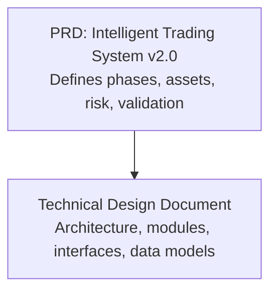
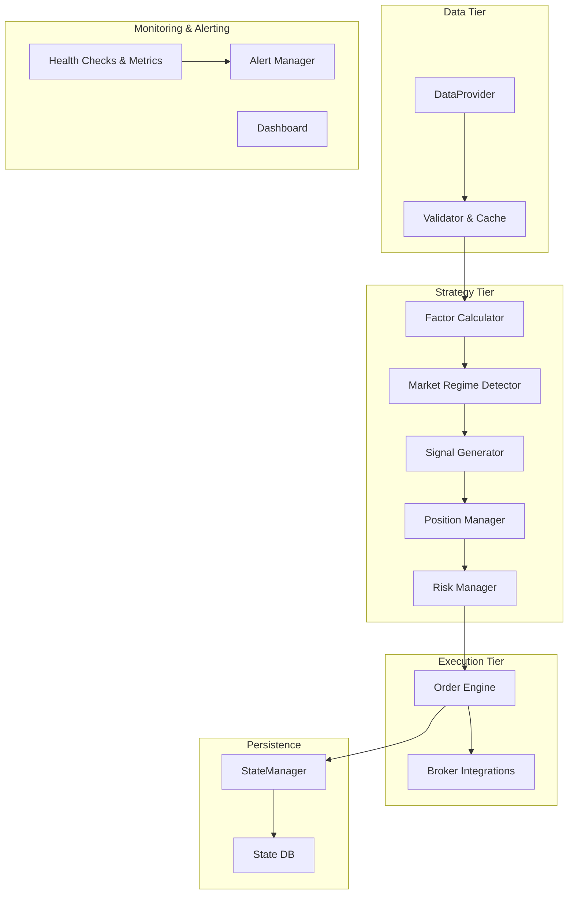
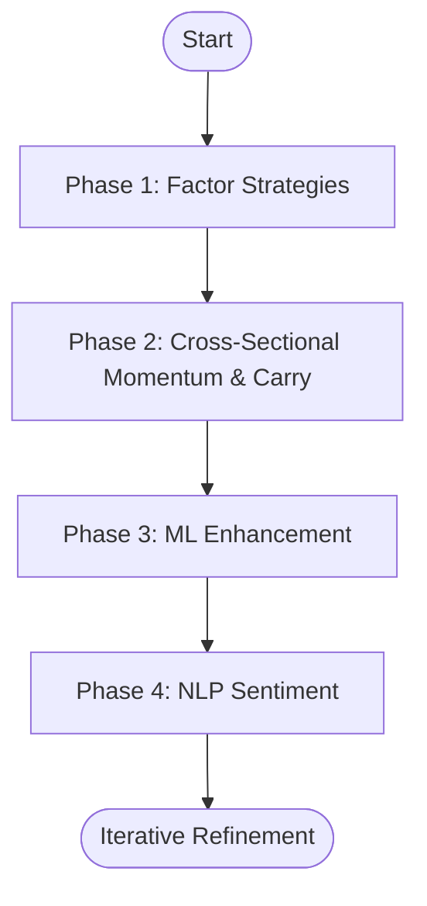
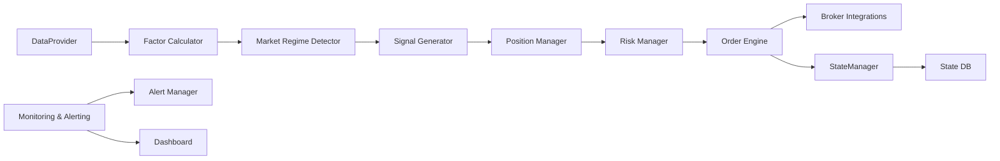

# System Introduction

<cite>
**Referenced Files in This Document**
- [PRD_Intelligent_Trading_System_v2.md](file://PRD_Intelligent_Trading_System_v2.md)
- [Tech_Design_Document.md](file://Tech_Design_Document.md)
</cite>

## Table of Contents
1. [Introduction](#introduction)
2. [Project Structure](#project-structure)
3. [Core Components](#core-components)
4. [Architecture Overview](#architecture-overview)
5. [Detailed Component Analysis](#detailed-component-analysis)
6. [Dependency Analysis](#dependency-analysis)
7. [Performance Considerations](#performance-considerations)
8. [Troubleshooting Guide](#troubleshooting-guide)
9. [Conclusion](#conclusion)
10. [Appendices](#appendices)

## Introduction
The Intelligent Trading Decision System is a multi-asset quantitative trading platform designed to deliver robust, transparent, and scalable investment outcomes across 15+ asset classes. It combines classical quantitative factors with modern machine learning and natural language processing (NLP) to generate actionable trading signals and manage risk across equities, bonds, commodities, and cryptocurrencies.

The system follows a deliberate, phased development approach:
- Phase 1: Basic factor strategies (time series momentum, volatility targeting, risk parity)
- Phase 2: Cross-sectional momentum and carry strategies across a broadened asset universe
- Phase 3: Machine learning enhancement with ensemble learning and rigorous overfitting prevention
- Phase 4: NLP sentiment analysis integrated as an input feature to the ML pipeline

This phased evolution ensures strong empirical foundations, extensive backtesting, and conservative risk controls before introducing advanced techniques. The platform targets quant researchers, trading professionals, and institutional investors who seek a disciplined, explainable, and continuously evolving trading framework.

## Project Structure
The repository organizes the system around two primary artifacts:
- Product Requirements Document (PRD): Defines goals, asset universe, phase plans, risk controls, and validation gates
- Technical Design Document: Details architecture, modules, interfaces, data models, and operational requirements

**Diagram sources**
- [PRD_Intelligent_Trading_System_v2.md](file://PRD_Intelligent_Trading_System_v2.md#L1-L120)
- [Tech_Design_Document.md](file://Tech_Design_Document.md#L1-L120)

**Section sources**
- [PRD_Intelligent_Trading_System_v2.md](file://PRD_Intelligent_Trading_System_v2.md#L1-L120)
- [Tech_Design_Document.md](file://Tech_Design_Document.md#L1-L120)

## Core Components
The system is composed of layered components that handle data ingestion, factor computation, signal generation, risk management, position sizing, execution, and monitoring. These components are designed to be modular, testable, and extensible.

- Data Layer: Multi-source acquisition with validation and caching
- Strategy Layer: Factor computation, market regime detection, and signal generation
- Risk Management: Hierarchical risk controls with correlation monitoring and re-entry logic
- Position Management: Portfolio optimization and constraint enforcement
- Execution Engine: Order generation and routing
- Monitoring & Alerting: Multi-channel alerting and dashboards
- State Persistence & Disaster Recovery: Robust state management and recovery procedures
- Backtesting & Stress Testing: Comprehensive validation across historical regimes

These components interact through well-defined interfaces and data models, enabling iterative development and clear separation of concerns.

**Section sources**
- [Tech_Design_Document.md](file://Tech_Design_Document.md#L34-L117)
- [Tech_Design_Document.md](file://Tech_Design_Document.md#L207-L472)
- [Tech_Design_Document.md](file://Tech_Design_Document.md#L815-L888)
- [Tech_Design_Document.md](file://Tech_Design_Design_Document.md#L934-L1045)

## Architecture Overview
The system employs a modular, layered architecture with clear boundaries between data, strategy, execution, monitoring, and persistence. The design emphasizes risk-first controls, data quality, and operational resilience.

**Diagram sources**
- [Tech_Design_Document.md](file://Tech_Design_Document.md#L38-L117)
- [Tech_Design_Document.md](file://Tech_Design_Document.md#L209-L472)
- [Tech_Design_Document.md](file://Tech_Design_Document.md#L815-L888)
- [Tech_Design_Document.md](file://Tech_Design_Document.md#L835-L888)

**Section sources**
- [Tech_Design_Document.md](file://Tech_Design_Document.md#L34-L117)

## Detailed Component Analysis

### Phase 1: Basic Factor Strategies (MVP)
Purpose: Establish a functioning baseline system with clear, interpretable signals and disciplined risk controls.

Key capabilities:
- Time series momentum signals derived from 60–120 day returns
- Volatility targeting to normalize position sizing across assets
- Risk parity portfolio construction for diversified exposures
- Market regime filtering using VIX thresholds
- Hierarchical risk controls with progressive de-risking
- Paper trading gate requirements prior to live deployment

Practical outcomes:
- Generates BUY/SELL/HOLD signals with confidence and target weights
- Enforces maximum leverage, turnover, and cash buffers
- Provides daily reports and alerts for transparency

**Section sources**
- [PRD_Intelligent_Trading_System_v2.md](file://PRD_Intelligent_Trading_System_v2.md#L129-L417)
- [Tech_Design_Document.md](file://Tech_Design_Document.md#L209-L472)

### Phase 2: Cross-Sectional Momentum and Carry
Purpose: Expand the asset universe to enable statistically meaningful cross-sectional ranking and introduce carry-based strategies.

Key capabilities:
- Cross-sectional momentum across 15 assets (Top 30% long, Bottom 30% avoided)
- Crypto carry strategy using funding rates for perpetuals
- Tactical asset allocation combining momentum ranking with risk parity optimization
- Enhanced correlation monitoring and defensive mode triggers
- Monthly re-balancing with turnover constraints

Practical outcomes:
- Improved diversification and reduced idiosyncratic risk
- Carry component adds yield enhancement in crypto markets
- Defensive filters protect during trending or mean-reverting regimes

**Section sources**
- [PRD_Intelligent_Trading_System_v2.md](file://PRD_Intelligent_Trading_System_v2.md#L459-L568)
- [Tech_Design_Document.md](file://Tech_Design_Document.md#L575-L678)

### Phase 3: Machine Learning Enhancement
Purpose: Introduce predictive models to improve signal quality while preventing overfitting.

Key capabilities:
- Feature engineering pipeline with macro, price, and cross-sectional factors
- Ensemble learning with rigorous walk-forward and combinatorial purged cross-validation
- Model lifecycle management including scheduled retraining and concept drift detection
- Predictive fusion blending ML signals with traditional signals under strict constraints
- Explainability via SHAP analysis and feature importance monitoring

Practical outcomes:
- Higher-quality signals with controlled model risk
- Transparent attribution of decisions through explainability
- Automated model retirement and replacement policies

**Section sources**
- [PRD_Intelligent_Trading_System_v2.md](file://PRD_Intelligent_Trading_System_v2.md#L571-L721)
- [Tech_Design_Document.md](file://Tech_Design_Document.md#L473-L573)

### Phase 4: NLP Sentiment Integration
Purpose: Incorporate textual sentiment as an input feature to the ML pipeline, enhancing alpha discovery.

Key capabilities:
- News sentiment analysis using FinBERT on headline-level text
- COT-based retail positioning contrarian signals
- Daily aggregation and sentiment momentum features
- Integration into ML feature sets with validation and pruning

Practical outcomes:
- Adds another dimension to factor sets without replacing traditional signals
- Enables early reaction to market-moving narratives
- Maintains conservative deployment constraints and interpretability

**Section sources**
- [PRD_Intelligent_Trading_System_v2.md](file://PRD_Intelligent_Trading_System_v2.md#L724-L800)
- [Tech_Design_Document.md](file://Tech_Design_Document.md#L680-L769)

### Conceptual Overview
The system’s evolution demonstrates a clear progression from simple, robust rules to sophisticated, explainable ML with NLP augmentation. Each phase builds upon validated performance and risk controls, ensuring sustainable growth.

[No sources needed since this diagram shows conceptual workflow, not actual code structure]

## Dependency Analysis
The system’s design promotes low coupling and high cohesion among modules. Dependencies flow from data ingestion to strategy generation, then to risk management and execution, with feedback loops for monitoring and persistence.

**Diagram sources**
- [Tech_Design_Document.md](file://Tech_Design_Document.md#L38-L117)
- [Tech_Design_Document.md](file://Tech_Design_Document.md#L815-L888)
- [Tech_Design_Document.md](file://Tech_Design_Document.md#L835-L888)

**Section sources**
- [Tech_Design_Document.md](file://Tech_Design_Document.md#L34-L117)

## Performance Considerations
- Strategy performance targets include Sharpe ratio, maximum drawdown, and turnover constraints
- System performance targets define latency, backtest speed, memory usage, and recovery time
- Scalability is considered through containerization, potential microservices decomposition, and caching layers

[No sources needed since this section provides general guidance]

## Troubleshooting Guide
Common areas to investigate:
- Data quality: Missing values, price jumps, cross-source deviations
- Risk controls: Trigger levels, correlation thresholds, re-entry conditions
- Model lifecycle: Retraining triggers, concept drift detection, retirement criteria
- State persistence: Recovery procedures, reconciliation with broker, backup and restore

**Section sources**
- [Tech_Design_Document.md](file://Tech_Design_Document.md#L815-L888)
- [Tech_Design_Document.md](file://Tech_Design_Document.md#L835-L888)
- [Tech_Design_Document.md](file://Tech_Design_Document.md#L526-L573)

## Conclusion
The Intelligent Trading Decision System offers a pragmatic, risk-aware pathway from basic factor strategies to machine learning and NLP-enhanced decision-making. Its phased approach, strong emphasis on validation and risk controls, and modular architecture make it suitable for quant researchers, trading professionals, and institutional investors seeking a transparent, extensible, and production-ready platform.

[No sources needed since this section summarizes without analyzing specific files]

## Appendices

### Target Audience
- Quantitative researchers: Building and validating factor and ML models
- Trading professionals: Implementing and operating the system in live environments
- Institutional investors: Deploying the system across portfolios with compliance and risk controls

[No sources needed since this section provides general guidance]

### Core Value Proposition
- Combines traditional quantitative factors with modern ML and NLP to enhance alpha discovery
- Emphasizes explainability, risk controls, and operational resilience
- Evolves iteratively with clear gates and validation criteria

[No sources needed since this section provides general guidance]