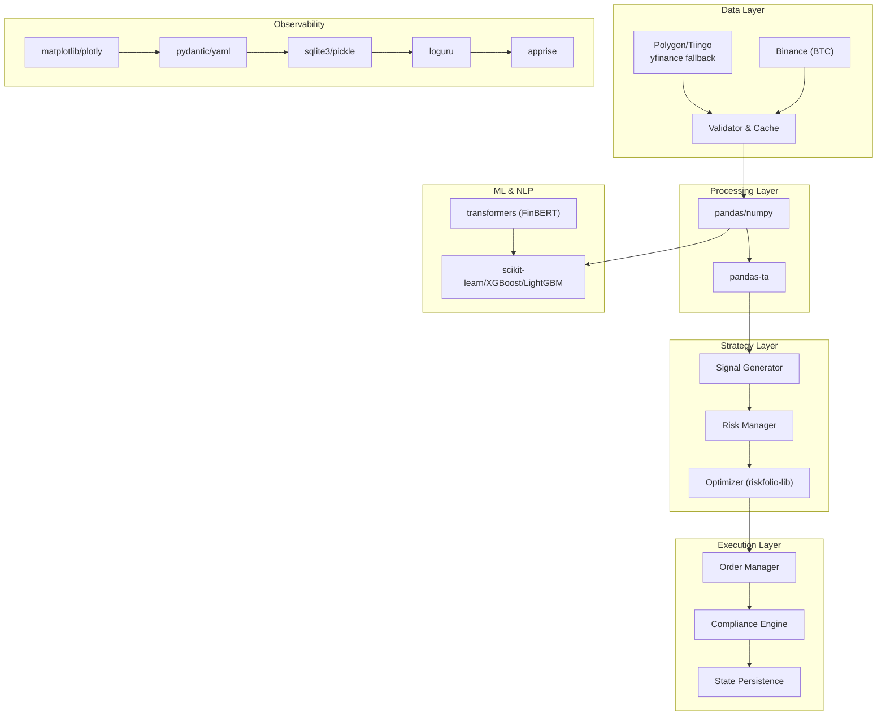
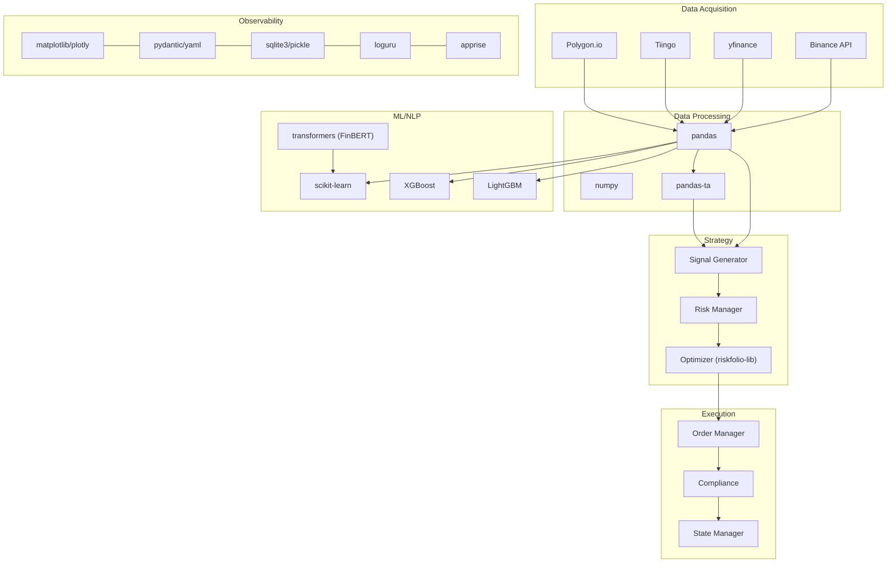
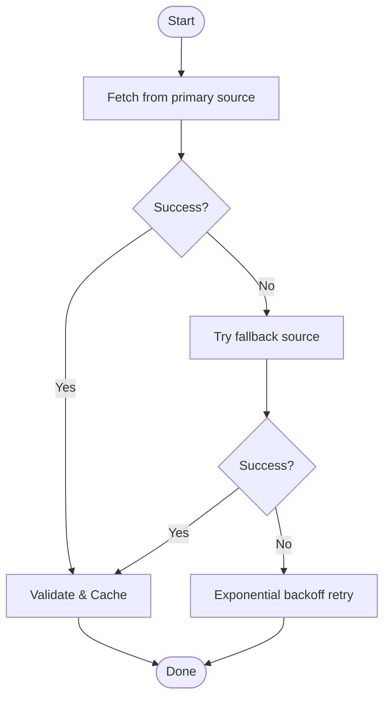
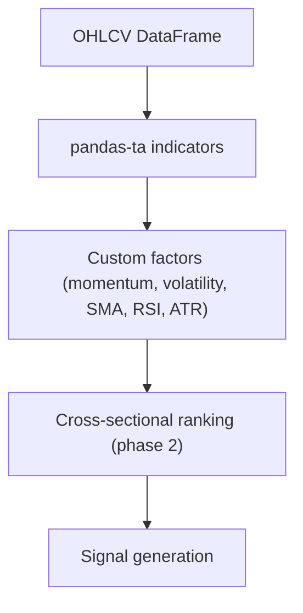
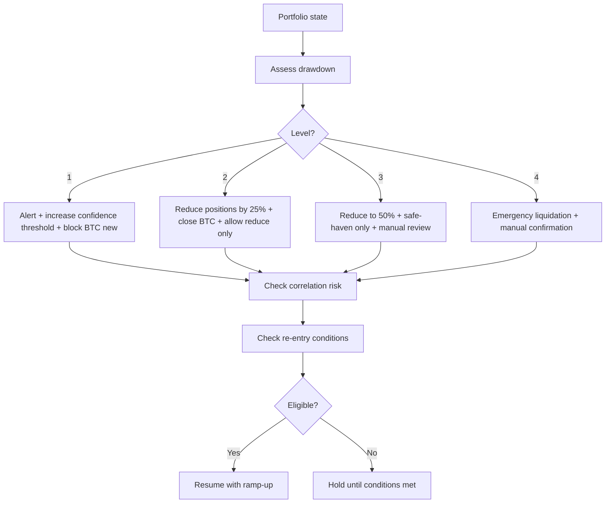
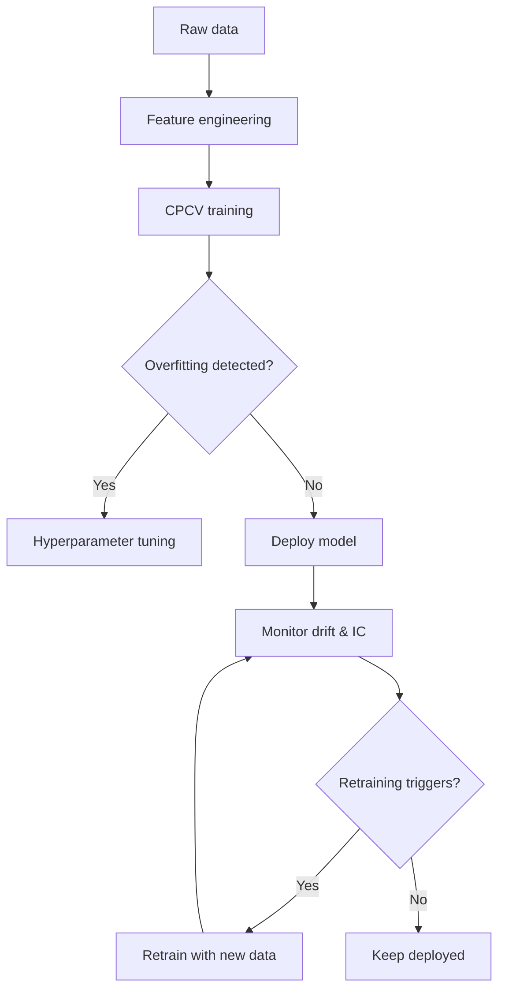
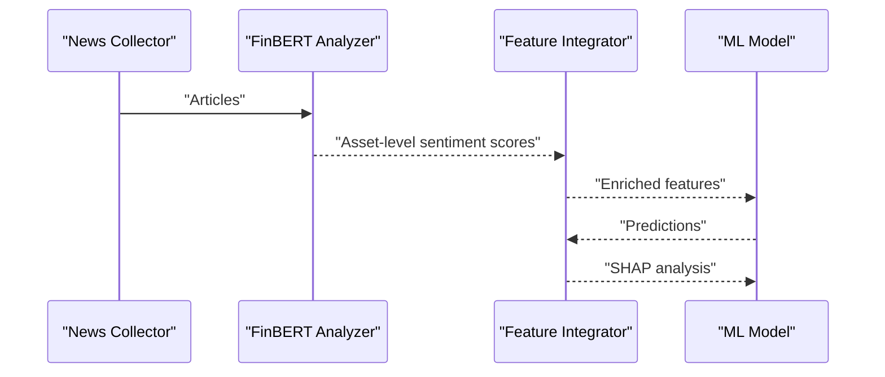
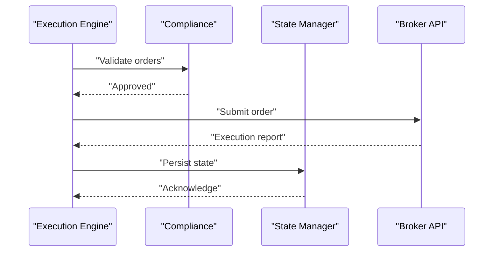
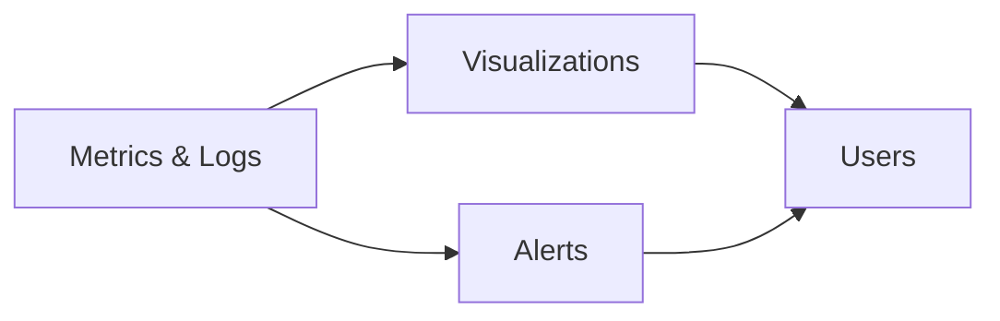
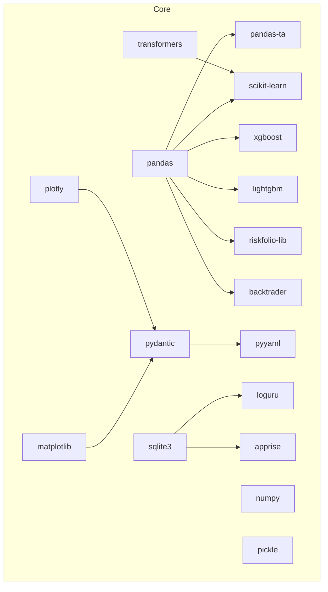

# Technology Stack

<cite>
**Referenced Files in This Document**
- [PRD_Intelligent_Trading_System_v2.md](file://PRD_Intelligent_Trading_System_v2.md)
- [Tech_Design_Document.md](file://Tech_Design_Document.md)
- [pyproject.toml](file://pyproject.toml)
</cite>

## Table of Contents
1. [Introduction](#introduction)
2. [Project Structure](#project-structure)
3. [Core Components](#core-components)
4. [Architecture Overview](#architecture-overview)
5. [Detailed Component Analysis](#detailed-component-analysis)
6. [Dependency Analysis](#dependency-analysis)
7. [Performance Considerations](#performance-considerations)
8. [Troubleshooting Guide](#troubleshooting-guide)
9. [Conclusion](#conclusion)
10. [Appendices](#appendices)

## Introduction
This document explains the layered technology architecture and the rationale for each technology choice in the Intelligent Trading Decision System. It covers data acquisition, processing, technical analysis, backtesting, portfolio optimization, machine learning, natural language processing, visualization, configuration, persistence, logging, and alerting. For each layer, we describe performance characteristics, community support, maintenance status, integration capabilities, trade-offs, and version compatibility requirements with upgrade paths.

## Project Structure
The system is organized into distinct layers with clear responsibilities:
- Data layer: multi-source acquisition, validation, caching, and persistence
- Strategy layer: factor computation, signal generation, risk management, and portfolio optimization
- Execution layer: order management, compliance, and state synchronization
- Monitoring and alerting: health checks, metrics, and multi-channel notifications
- Backtesting and reporting: walk-forward validation, stress testing, and dashboards
- ML pipeline: feature engineering, training with CPCV, monitoring, and lifecycle management
- NLP pipeline: sentiment extraction and integration into ML features



**Diagram sources**
- [Tech_Design_Document.md](file://Tech_Design_Document.md#L88-L117)
- [pyproject.toml](file://pyproject.toml#L9-L34)

**Section sources**
- [Tech_Design_Document.md](file://Tech_Design_Document.md#L34-L117)

## Core Components
Below are the technologies and their rationales across layers, aligned with the product and technical design documents.

- Data acquisition
  - Primary: polygon-api-client, tiingo for reliable, production-grade market data
  - Fallback: yfinance for free development/backtesting
  - Specialized: python-binance for canonical BTC funding-rate and price data
  - Rationale: multi-source strategy ensures resilience; polygon/tiingo offer comprehensive coverage; yfinance is convenient for offline/educational use; python-binance provides accurate crypto data needed for carry strategies
  - Performance: REST APIs with retry/backoff; caching reduces latency and cost
  - Community/maintenance: actively maintained libraries; strong documentation and community support
  - Integration: straightforward HTTP clients; schema-compatible with pandas DataFrames

- Data processing
  - pandas, numpy: industry-standard for time series and numerical computing
  - Rationale: performance, ecosystem maturity, and seamless integration with stats and ML libraries
  - Performance: vectorized operations, optimized indexing, memory-efficient resampling
  - Community/maintenance: extremely active; frequent updates and extensive documentation

- Technical analysis
  - pandas-ta replaces ta-lib to avoid compilation issues
  - Rationale: mature, pure-Python indicators; good performance for typical workloads
  - Performance: efficient rolling computations; minimal overhead
  - Community/maintenance: actively maintained; regular releases

- Backtesting
  - Backtrader unified framework; replaced Zipline ambiguity
  - Rationale: comprehensive engine, modular design, strong community, and extensive documentation
  - Performance: suitable for research-grade backtests; can be scaled with parallelization
  - Community/maintenance: stable and widely adopted in quant finance

- Portfolio optimization
  - riskfolio-lib replaces pyriskparity; broader feature set and active maintenance
  - Rationale: supports risk parity, mean-variance optimization, and advanced constraints
  - Performance: robust solvers; handles medium-sized problems efficiently
  - Community/maintenance: active development and good documentation

- Machine learning
  - scikit-learn, XGBoost, LightGBM
  - Rationale: interpretability, speed, and strong performance; XGBoost/LightGBM for gradient boosting; scikit-learn for baselines and preprocessing
  - Performance: competitive inference speed; efficient hyperparameter tuning
  - Community/maintenance: very active ecosystems; extensive tutorials and benchmarks

- NLP (sentiment)
  - transformers with FinBERT for Phase 4 sentiment features
  - Rationale: pre-trained financial domain model; integrates easily into ML pipelines
  - Performance: GPU acceleration recommended; CPU feasible but slower
  - Community/maintenance: Hugging Face ecosystem; frequent updates and community support

- Visualization
  - matplotlib, plotly
  - Rationale: static plots and interactive dashboards; broad compatibility
  - Performance: efficient for typical chart sizes; interactivity can be tuned
  - Community/maintenance: mature and widely used

- Configuration
  - pydantic, yaml
  - Rationale: type-safe configuration with runtime validation; human-readable YAML
  - Performance: negligible overhead; improves developer productivity
  - Community/maintenance: actively maintained; excellent integration with modern Python stacks

- Persistence
  - sqlite3, pickle
  - Rationale: lightweight, embedded storage for state and logs; simple deployment
  - Performance: adequate for moderate-scale state; consider migration to PostgreSQL for scale
  - Community/maintenance: standard library; stable and portable

- Logging
  - loguru
  - Rationale: pragmatic, structured logging with minimal boilerplate
  - Performance: fast and thread-safe; supports sinks and contextual bindings
  - Community/maintenance: actively developed; growing adoption

- Alerting
  - apprise
  - Rationale: multi-channel notifications (Slack, Email, Telegram) from a single interface
  - Performance: lightweight; synchronous delivery acceptable for alerts
  - Community/maintenance: actively maintained; flexible configuration

**Section sources**
- [PRD_Intelligent_Trading_System_v2.md](file://PRD_Intelligent_Trading_System_v2.md#L108-L126)
- [Tech_Design_Document.md](file://Tech_Design_Document.md#L121-L140)
- [pyproject.toml](file://pyproject.toml#L9-L34)

## Architecture Overview
The system follows a layered architecture with explicit separation of concerns:
- Data ingestion with fallback and validation
- Factor computation and technical analysis
- Signal generation with regime-aware filtering
- Risk management with hierarchical controls and correlation monitoring
- Portfolio optimization and order execution
- State persistence and disaster recovery
- ML and NLP pipelines integrated into the feature set
- Observability and alerting across all layers



**Diagram sources**
- [Tech_Design_Document.md](file://Tech_Design_Document.md#L38-L117)
- [pyproject.toml](file://pyproject.toml#L9-L34)

## Detailed Component Analysis

### Data Acquisition and Processing
- Multi-source acquisition with automatic fallback ensures resilience and cost control
- Validation and caching reduce noise and improve performance
- pandas/numpy provide efficient, standardized processing



**Diagram sources**
- [Tech_Design_Document.md](file://Tech_Design_Document.md#L209-L239)

**Section sources**
- [Tech_Design_Document.md](file://Tech_Design_Document.md#L209-L248)
- [PRD_Intelligent_Trading_System_v2.md](file://PRD_Intelligent_Trading_System_v2.md#L184-L201)

### Technical Analysis and Factor Computation
- pandas-ta provides a wide range of indicators; configurable lookbacks and transforms
- Cross-sectional ranking enables phase 2 strategies



**Diagram sources**
- [Tech_Design_Document.md](file://Tech_Design_Document.md#L250-L295)

**Section sources**
- [Tech_Design_Document.md](file://Tech_Design_Document.md#L250-L295)
- [PRD_Intelligent_Trading_System_v2.md](file://PRD_Intelligent_Trading_System_v2.md#L203-L218)

### Risk Management and Re-Entry Logic
- Hierarchical risk control with correlation monitoring and re-entry gating
- Controls escalate based on portfolio drawdown and extreme volatility



**Diagram sources**
- [Tech_Design_Document.md](file://Tech_Design_Document.md#L352-L437)

**Section sources**
- [Tech_Design_Document.md](file://Tech_Design_Document.md#L352-L437)
- [PRD_Intelligent_Trading_System_v2.md](file://PRD_Intelligent_Trading_System_v2.md#L288-L332)

### Portfolio Optimization
- Risk parity and mean-variance optimization with position constraints
- Integration with riskfolio-lib for robust solutions

```mermaid
sequenceDiagram
participant Sig as "Signal Generator"
participant Fac as "Factor Calculator"
participant Opt as "Optimizer"
participant Port as "Portfolio"
Sig->>Fac : "Factors"
Fac-->>Sig : "Factor DataFrame"
Sig->>Opt : "Targets + constraints"
Opt-->>Port : "Optimal weights"
Port-->>Sig : "Updated positions"
```

**Diagram sources**
- [Tech_Design_Document.md](file://Tech_Design_Document.md#L473-L573)

**Section sources**
- [Tech_Design_Document.md](file://Tech_Design_Document.md#L473-L573)

### Machine Learning Pipeline
- Robust feature engineering with point-in-time processing and macro features
- Training with combinatorial purged cross-validation and overfitting detection
- Model lifecycle management with retraining and retirement policies



**Diagram sources**
- [Tech_Design_Document.md](file://Tech_Design_Document.md#L474-L573)

**Section sources**
- [Tech_Design_Document.md](file://Tech_Design_Document.md#L474-L573)
- [PRD_Intelligent_Trading_System_v2.md](file://PRD_Intelligent_Trading_System_v2.md#L615-L721)

### NLP Sentiment Pipeline
- FinBERT-based sentiment scoring from news and COT-derived retail positioning
- Integration into ML features with SHAP analysis for interpretability



**Diagram sources**
- [Tech_Design_Document.md](file://Tech_Design_Document.md#L680-L770)

**Section sources**
- [Tech_Design_Document.md](file://Tech_Design_Document.md#L680-L770)
- [PRD_Intelligent_Trading_System_v2.md](file://PRD_Intelligent_Trading_System_v2.md#L760-L800)

### Execution, Compliance, and State Persistence
- Order management with smart routing and compliance checks
- State persistence for crash recovery and auditability
- Disaster recovery reconciles with broker state



**Diagram sources**
- [Tech_Design_Document.md](file://Tech_Design_Document.md#L771-L888)

**Section sources**
- [Tech_Design_Document.md](file://Tech_Design_Document.md#L771-L888)
- [PRD_Intelligent_Trading_System_v2.md](file://PRD_Intelligent_Trading_System_v2.md#L381-L417)

### Monitoring, Visualization, and Alerting
- Metrics dashboards and alerting across levels
- Plotly for interactive visuals; matplotlib for publication-quality figures



**Diagram sources**
- [Tech_Design_Document.md](file://Tech_Design_Document.md#L1234-L1270)
- [Tech_Design_Document.md](file://Tech_Design_Document.md#L815-L833)

**Section sources**
- [Tech_Design_Document.md](file://Tech_Design_Document.md#L1234-L1270)
- [Tech_Design_Document.md](file://Tech_Design_Document.md#L815-L833)

## Dependency Analysis
The dependency graph reflects the layered architecture and core technology stack.



**Diagram sources**
- [pyproject.toml](file://pyproject.toml#L9-L34)

**Section sources**
- [pyproject.toml](file://pyproject.toml#L9-L34)

## Performance Considerations
- Data layer: caching and fallback reduce latency and API costs; consider Redis for shared caches in distributed deployments
- Processing layer: leverage vectorized pandas operations; resample and align frequencies carefully
- ML layer: use LightGBM/XGBoost for speed; tune early stopping and pruning; validate with CPCV
- Risk layer: correlation matrices and optimization scale with assets; batch operations and sparse matrices help
- Visualization: interactive plots can be expensive; precompute static charts and lazy-load interactivity
- Observability: centralized logging and metrics; ensure sinks are asynchronous to avoid blocking

[No sources needed since this section provides general guidance]

## Troubleshooting Guide
- Data quality issues: enable multi-source validation and cross-check deviations; configure alerts for missing data and price jumps
- Model overfitting: enforce CPCV, purge gaps, embargo periods; monitor IC and stability
- System downtime: implement health checks, auto-recovery, and alert escalation
- Security: manage secrets via environment variables or secret managers; encrypt at rest and in transit
- Regulatory compliance: enforce PDT and wash-sale rules automatically; maintain audit trails

**Section sources**
- [Tech_Design_Document.md](file://Tech_Design_Document.md#L1313-L1334)
- [Tech_Design_Document.md](file://Tech_Design_Document.md#L1049-L1071)

## Conclusion
The technology stack balances performance, maintainability, and scalability. Each layer leverages mature, actively maintained libraries with strong community support. The architecture supports iterative development, rigorous validation, and production readiness, with clear upgrade paths and extensibility points.

[No sources needed since this section summarizes without analyzing specific files]

## Appendices

### Version Compatibility and Upgrade Paths
- Language and package manager
  - Python: 3.12+ (project requires 3.12; linters configured for 3.10)
  - Poetry: latest for dependency management and reproducible builds
- Core libraries
  - pandas >= 2.0.0, numpy >= 1.24.0
  - pandas-ta >= 0.3.14b0,<0.4.0
  - backtrader >= 1.9.76.123
  - riskfolio-lib >= 5.0.0
  - scikit-learn >= 1.3.0
  - xgboost >= 2.0.0
  - lightgbm >= 4.0.0
  - transformers >= 4.30.0
  - matplotlib >= 3.7.0, plotly >= 5.15.0
  - pydantic >= 2.0.0, pyyaml >= 6.0
  - loguru >= 0.7.0, apprise >= 1.7.0
  - pytest, pytest-cov, black, ruff, mypy for tooling
  - yfinance >= 0.2.18, polygon-api-client >= 1.14.0, python-binance >= 1.0.17
- Upgrade strategy
  - Pin minor versions; allow patch updates within minor
  - Use Poetry lockfiles for reproducibility
  - Validate with CPCV and stress tests after upgrades
  - Monitor breaking changes in ML libraries (XGBoost/LightGBM) and pandas-ta

**Section sources**
- [pyproject.toml](file://pyproject.toml#L8-L34)
- [Tech_Design_Document.md](file://Tech_Design_Document.md#L121-L140)