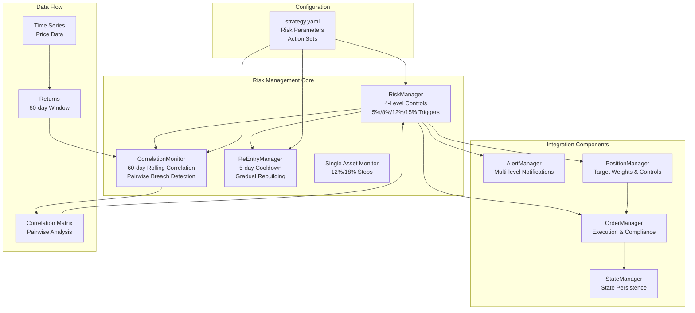
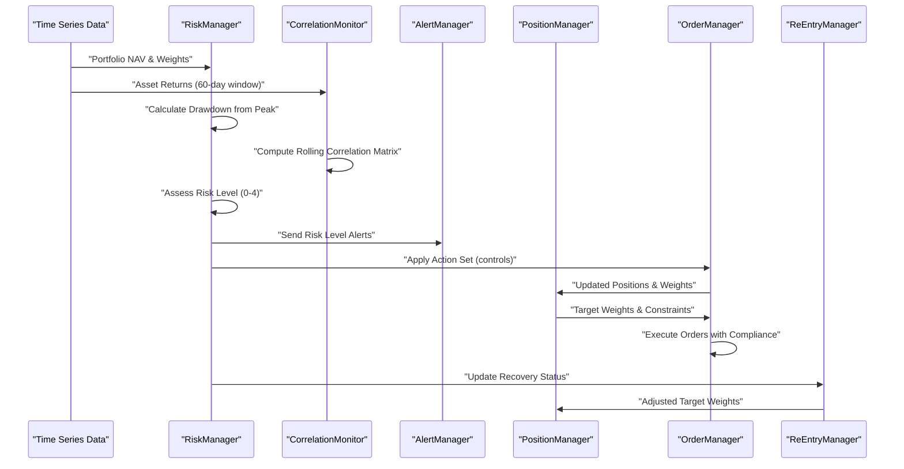
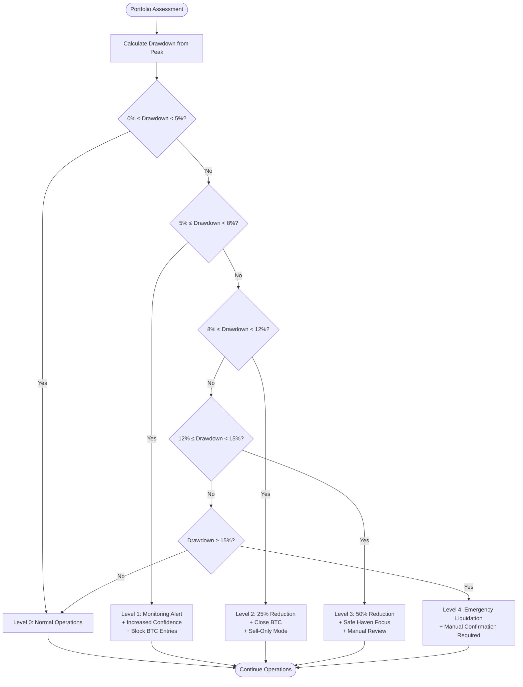
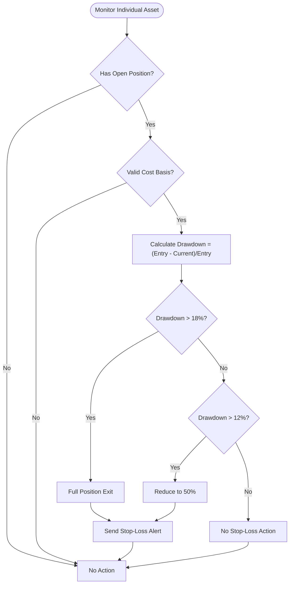
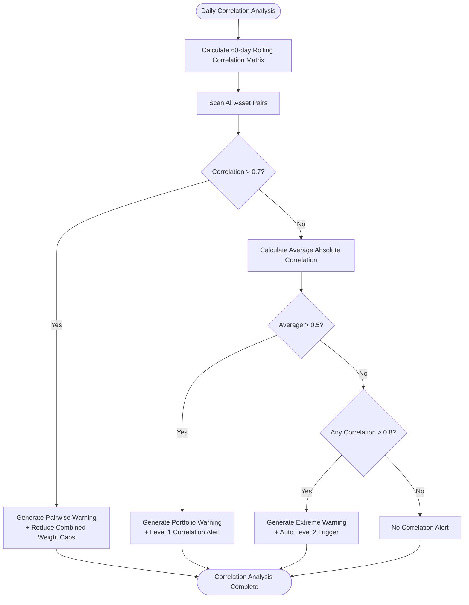
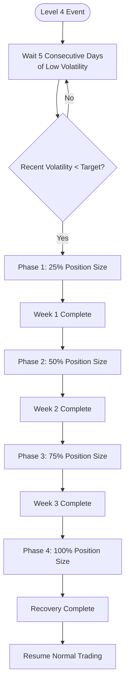
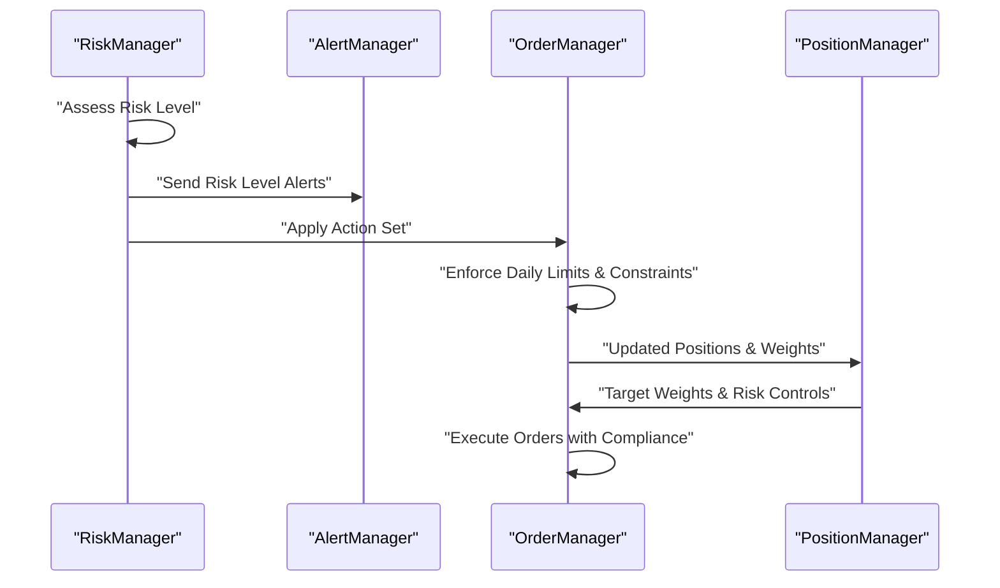
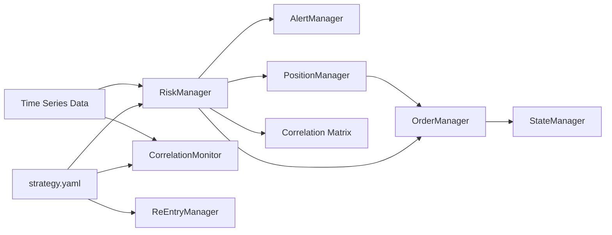

# Risk Management System

<cite>
**Referenced Files in This Document**
- [PRD_Intelligent_Trading_System_v2.md](file://PRD_Intelligent_Trading_System_v2.md)
- [Tech_Design_Document.md](file://Tech_Design_Document.md)
- [src/risk/manager.py](file://src/risk/manager.py)
- [src/risk/correlation.py](file://src/risk/correlation.py)
- [src/risk/reentry.py](file://src/risk/reentry.py)
- [src/models/domain.py](file://src/models/domain.py)
- [src/alerts/manager.py](file://src/alerts/manager.py)
- [src/execution/order_manager.py](file://src/execution/order_manager.py)
- [config/strategy.yaml](file://config/strategy.yaml)
- [main.py](file://main.py)
</cite>

## Update Summary
**Changes Made**
- Complete implementation of four-level hierarchical risk control system with precise drawdown thresholds (5%, 8%, 12%, 15%)
- Added single asset stop-loss mechanisms with 12% reduction to 50% and 18% full exit thresholds
- Implemented position reduction factors (100%, 75%, 50%, 0%) corresponding to risk levels
- Added safe haven asset identification (GLD, TLT) for risk level 3 protection
- Complete correlation monitoring with 60-day rolling correlation matrices and pairwise breach detection
- Integrated re-entry procedures with 5-day cooldown and gradual position rebuilding
- Enhanced alert system with multi-level risk notifications

## Table of Contents
1. [Introduction](#introduction)
2. [Project Structure](#project-structure)
3. [Core Components](#core-components)
4. [Architecture Overview](#architecture-overview)
5. [Detailed Component Analysis](#detailed-component-analysis)
6. [Dependency Analysis](#dependency-analysis)
7. [Performance Considerations](#performance-considerations)
8. [Troubleshooting Guide](#troubleshooting-guide)
9. [Conclusion](#conclusion)
10. [Appendices](#appendices)

## Introduction
This document describes the complete hierarchical risk management system that replaces a simple hard stop-loss with a sophisticated graduated de-risking architecture. The system implements a four-level risk control framework with precise drawdown thresholds, correlation monitoring, single-asset stop-loss logic, and disciplined recovery protocols. The system monitors portfolio drawdown and asset correlation relationships, automatically triggers mitigation actions at escalating levels, and defines comprehensive recovery procedures.

## Project Structure
The risk management system is a modular component integrated throughout the trading system. The implementation includes dedicated modules for risk assessment, correlation monitoring, re-entry management, and alert notifications, all coordinated through the main trading system orchestration.

**Diagram sources**
- [src/risk/manager.py](file://src/risk/manager.py#L9-L38)
- [src/risk/correlation.py](file://src/risk/correlation.py#L19-L31)
- [src/risk/reentry.py](file://src/risk/reentry.py#L8-L25)
- [config/strategy.yaml](file://config/strategy.yaml#L46-L91)

**Section sources**
- [src/risk/manager.py](file://src/risk/manager.py#L9-L38)
- [src/risk/correlation.py](file://src/risk/correlation.py#L19-L31)
- [src/risk/reentry.py](file://src/risk/reentry.py#L8-L25)
- [config/strategy.yaml](file://config/strategy.yaml#L46-L91)

## Core Components

### RiskManager - Four-Level Hierarchical Controls
Implements the complete four-level risk control system with precise drawdown thresholds and action sets:
- **Level 0 (0-5% drawdown)**: Normal operation with baseline controls
- **Level 1 (5-8% drawdown)**: Monitoring alert, increased confidence threshold, block new BTC exposure
- **Level 2 (8-12% drawdown)**: 25% position reduction, BTC closure, sell-only operations
- **Level 3 (12-15% drawdown)**: 50% position reduction, safe-haven focus (GLD, TLT), manual review
- **Level 4 (>15% drawdown)**: Emergency liquidation, cash/GLD retention, manual confirmation required

### CorrelationMonitor - Advanced Correlation Risk Management
Computes 60-day rolling correlation matrices and detects various correlation risk scenarios:
- **Pairwise correlation > 0.7**: Reduces combined weight caps for affected pairs
- **Average portfolio correlation > 0.5**: Level 1 correlation alert
- **Uniform extreme movement > 0.8**: Auto Level 2 correlation-triggered action
- **Safe haven identification**: Automatic recognition of GLD and TLT as safe assets

### ReEntryManager - Controlled Recovery Protocol
Manages systematic recovery after severe drawdown events:
- **5-day cooldown period**: Requires consecutive days of low volatility
- **Gradual position rebuilding**: 25% → 50% → 75% → 100% over 4 weeks
- **Reduced leverage**: Maximum 1.0x leverage during recovery period
- **Automatic restart conditions**: Resumes normal trading when volatility targets met

### Single Asset Monitor - Idiosyncratic Risk Protection
Provides individual asset-level stop-loss protection:
- **12% drawdown**: Reduce position to 50% of target
- **18% drawdown**: Full position exit
- **Independent triggering**: Operates separately from portfolio-level controls
- **Real-time monitoring**: Continuously tracks individual asset performance

**Section sources**
- [src/risk/manager.py](file://src/risk/manager.py#L9-L38)
- [src/risk/correlation.py](file://src/risk/correlation.py#L19-L31)
- [src/risk/reentry.py](file://src/risk/reentry.py#L8-L25)
- [config/strategy.yaml](file://config/strategy.yaml#L74-L91)

## Architecture Overview
The risk system operates as a central control mechanism that continuously monitors portfolio health and market conditions, automatically applying appropriate risk controls while maintaining system stability and recovery capabilities.

**Diagram sources**
- [main.py](file://main.py#L101-L200)
- [src/risk/manager.py](file://src/risk/manager.py#L39-L80)
- [src/risk/correlation.py](file://src/risk/correlation.py#L32-L52)

## Detailed Component Analysis

### Four-Level Progressive De-Risking Architecture

#### Level 1: Monitoring Alert (5-8% drawdown)
- **Triggers**: Portfolio drawdown reaches 5-8%
- **Actions**: 
  - Send monitoring alert
  - Increase confidence threshold for new entries
  - Block new BTC exposure
  - Maintain normal trading operations
- **Duration**: Continuous until drawdown returns below 5%

#### Level 2: Progressive Reduction (8-12% drawdown)
- **Triggers**: Portfolio drawdown reaches 8-12%
- **Actions**:
  - Reduce all positions by 25%
  - Close BTC positions immediately
  - Permit only sell orders and hedging
  - Record reasons for transparency
- **Duration**: Until drawdown returns below 8%

#### Level 3: Major Reduction (12-15% drawdown)
- **Triggers**: Portfolio drawdown reaches 12-15%
- **Actions**:
  - Reduce all positions to 50% of target
  - Retain only safe-haven assets (GLD, TLT)
  - Initiate manual review process
  - Implement strict position sizing
- **Duration**: Until drawdown returns below 12%

#### Level 4: Emergency Liquidation (>15% drawdown)
- **Triggers**: Portfolio drawdown exceeds 15%
- **Actions**:
  - Liquidate all risky assets immediately
  - Retain cash and GLD (unless GLD itself triggers stop)
  - Require manual confirmation to resume trading
  - Implement emergency recovery protocols
- **Duration**: Until manual override and recovery conditions met

**Diagram sources**
- [src/risk/manager.py](file://src/risk/manager.py#L12-L19)
- [config/strategy.yaml](file://config/strategy.yaml#L48-L72)

**Section sources**
- [src/risk/manager.py](file://src/risk/manager.py#L12-L19)
- [config/strategy.yaml](file://config/strategy.yaml#L48-L72)

### Single Asset Stop-Loss Mechanism

The system implements independent stop-loss protection for individual assets to prevent catastrophic idiosyncratic losses:

#### Stop-Loss Thresholds
- **Partial Stop (12% drawdown)**: Automatically reduce position to 50% of target
- **Full Stop (18% drawdown)**: Immediately exit entire position
- **Independent Operation**: Functions separately from portfolio-level controls
- **Real-time Monitoring**: Continuously tracks individual asset performance

#### Implementation Details

**Diagram sources**
- [src/risk/manager.py](file://src/risk/manager.py#L121-L146)

**Section sources**
- [src/risk/manager.py](file://src/risk/manager.py#L21-L25)
- [src/risk/manager.py](file://src/risk/manager.py#L121-L146)
- [config/strategy.yaml](file://config/strategy.yaml#L74-L76)

### Correlation Monitoring and Risk Detection

The correlation monitoring system provides early warning of systemic market risks through advanced statistical analysis:

#### Correlation Thresholds
- **Pairwise Warning (0.7)**: Identifies high-correlation asset pairs
- **Portfolio Average Warning (0.5)**: Signals broad market correlation
- **Extreme Event (0.8)**: Indicates systemic market stress

#### Correlation Analysis Process

**Diagram sources**
- [src/risk/correlation.py](file://src/risk/correlation.py#L53-L121)

**Section sources**
- [src/risk/correlation.py](file://src/risk/correlation.py#L22-L26)
- [src/risk/correlation.py](file://src/risk/correlation.py#L53-L121)
- [config/strategy.yaml](file://config/strategy.yaml#L78-L82)

### Re-Entry Procedures and Recovery Protocols

After severe drawdown events, the system implements a controlled recovery process:

#### Recovery Phases
- **Phase 1 (Week 1)**: Start with 25% of normal position size
- **Phase 2 (Week 2)**: Increase to 50% of normal position size  
- **Phase 3 (Week 3)**: Increase to 75% of normal position size
- **Phase 4 (Week 4)**: Return to 100% of normal position size

#### Recovery Requirements
- **5-day Cooldown**: Portfolio volatility must remain below target level
- **Reduced Leverage**: Maximum 1.0x leverage during recovery
- **Gradual Rebuilding**: Systematic increase in position sizes
- **Manual Override**: Final approval required to exit recovery mode

**Diagram sources**
- [src/risk/reentry.py](file://src/risk/reentry.py#L26-L55)
- [src/risk/reentry.py](file://src/risk/reentry.py#L57-L78)

**Section sources**
- [src/risk/reentry.py](file://src/risk/reentry.py#L11-L17)
- [src/risk/reentry.py](file://src/risk/reentry.py#L26-L55)
- [src/risk/reentry.py](file://src/risk/reentry.py#L57-L78)
- [config/strategy.yaml](file://config/strategy.yaml#L84-L91)

### Automated Trigger Mechanisms and Action Sets

The risk system automatically applies appropriate controls based on the current risk level:

#### Action Set Mapping
- **Level 0**: Normal operations, baseline controls
- **Level 1**: Monitoring alert, confidence threshold increase, BTC exposure block
- **Level 2**: Position reduction, BTC closure, sell-only operations
- **Level 3**: Major reduction, safe-haven focus, manual review requirement
- **Level 4**: Emergency liquidation, manual confirmation requirement

#### Integration with Execution

**Diagram sources**
- [src/risk/manager.py](file://src/risk/manager.py#L101-L119)
- [src/alerts/manager.py](file://src/alerts/manager.py#L128-L142)
- [src/execution/order_manager.py](file://src/execution/order_manager.py#L29-L85)

**Section sources**
- [src/risk/manager.py](file://src/risk/manager.py#L101-L119)
- [src/alerts/manager.py](file://src/alerts/manager.py#L128-L142)
- [src/execution/order_manager.py](file://src/execution/order_manager.py#L29-L85)

### Configuration Parameters and Operational Procedures

#### Risk Control Configuration
- **Drawdown Thresholds**: 5%, 8%, 12%, 15% with corresponding action sets
- **Single Asset Stops**: 12% (partial) and 18% (full) drawdown thresholds
- **Correlation Parameters**: 0.7 (pairwise), 0.5 (average), 0.8 (extreme)
- **Recovery Settings**: 5-day cooldown, 25% weekly increases, 1.0x max leverage

#### Operational Procedures
- **Risk Assessment**: Daily drawdown calculation from peak NAV
- **Action Application**: Automatic execution of appropriate controls
- **Alert Generation**: Multi-level notifications based on risk severity
- **State Management**: Persistent tracking of risk levels and recovery status

**Section sources**
- [config/strategy.yaml](file://config/strategy.yaml#L46-L91)
- [src/models/domain.py](file://src/models/domain.py#L58-L62)
- [src/risk/manager.py](file://src/risk/manager.py#L34-L37)

## Dependency Analysis
The risk management system integrates with all major trading system components through well-defined interfaces and shared configuration:

**Diagram sources**
- [config/strategy.yaml](file://config/strategy.yaml#L46-L91)
- [main.py](file://main.py#L48-L55)

**Section sources**
- [config/strategy.yaml](file://config/strategy.yaml#L46-L91)
- [main.py](file://main.py#L48-L55)

## Performance Considerations
- **Correlation Computation**: Efficient rolling window calculations using pandas rolling operations
- **Risk Assessment**: Single daily evaluation with caching of intermediate results
- **Memory Management**: Configurable rolling windows to balance accuracy and memory usage
- **Alert Throttling**: Prevents alert flood during rapid risk level changes
- **Execution Efficiency**: Minimal overhead in normal operations, maximum responsiveness during risk events

## Troubleshooting Guide

### Common Issues and Solutions

#### False Positives in Risk Level Changes
- **Symptom**: Rapid oscillation between risk levels
- **Cause**: Slight drawdown fluctuations near threshold boundaries
- **Solution**: Verify drawdown calculations and consider smoothing techniques

#### Delayed Recovery After Level 4
- **Symptom**: Extended recovery period beyond expectations
- **Cause**: Volatility not meeting target thresholds consistently
- **Solution**: Monitor volatility history and adjust target thresholds if appropriate

#### Correlation Alert Delays
- **Symptom**: Late detection of correlation risks
- **Cause**: 60-day rolling window requires sufficient historical data
- **Solution**: Ensure adequate historical data availability and consider shorter windows for early detection

#### Single Asset Stop Misfires
- **Symptom**: Premature or delayed stop-loss triggers
- **Cause**: Inaccurate cost basis tracking or price data issues
- **Solution**: Verify entry price tracking and ensure real-time price updates

#### Recovery Mode Stuck
- **Symptom**: Unable to exit recovery mode
- **Cause**: Volatility not meeting recovery criteria consistently
- **Solution**: Check volatility calculations and adjust recovery parameters

**Section sources**
- [src/risk/manager.py](file://src/risk/manager.py#L64-L71)
- [src/risk/reentry.py](file://src/risk/reentry.py#L26-L55)

## Conclusion
The hierarchical risk management system provides comprehensive protection against various market risks through graduated de-risking, correlation-aware controls, and disciplined recovery protocols. The system's four-level architecture ensures appropriate responses to different severity levels while maintaining trading flexibility and capital preservation. The integration of single-asset stop-loss protection, correlation monitoring, and systematic recovery procedures creates a robust risk management framework suitable for various market conditions.

## Appendices

### Practical Examples: System Behavior Under Different Market Conditions

#### Mild Drawdown (5-8%)
- **Expected Response**: Level 1 monitoring alert with increased confidence thresholds
- **Actions**: Block new BTC exposure, maintain normal operations
- **Duration**: Until drawdown returns below 5%

#### Moderate Drawdown (8-12%)
- **Expected Response**: Level 2 progressive reduction (25% position reduction)
- **Actions**: Close BTC positions, permit only sell orders
- **Duration**: Until drawdown returns below 8%

#### Severe Drawdown (12-15%)
- **Expected Response**: Level 3 major reduction (50% position reduction)
- **Actions**: Retain safe-haven assets (GLD, TLT), initiate manual review
- **Duration**: Until drawdown returns below 12%

#### Extreme Drawdown (>15%)
- **Expected Response**: Level 4 emergency liquidation
- **Actions**: Liquidate risky assets, retain cash/GLD, require manual confirmation
- **Duration**: Until manual override and recovery conditions met

#### High Correlation Environment
- **Pairwise Correlation > 0.7**: Reduced weight caps for affected pairs
- **Average Correlation > 0.5**: Level 1 correlation alert
- **Average Correlation > 0.8**: Auto Level 2 correlation-triggered action

**Section sources**
- [src/risk/manager.py](file://src/risk/manager.py#L12-L19)
- [src/risk/correlation.py](file://src/risk/correlation.py#L74-L121)
- [src/risk/reentry.py](file://src/risk/reentry.py#L26-L55)