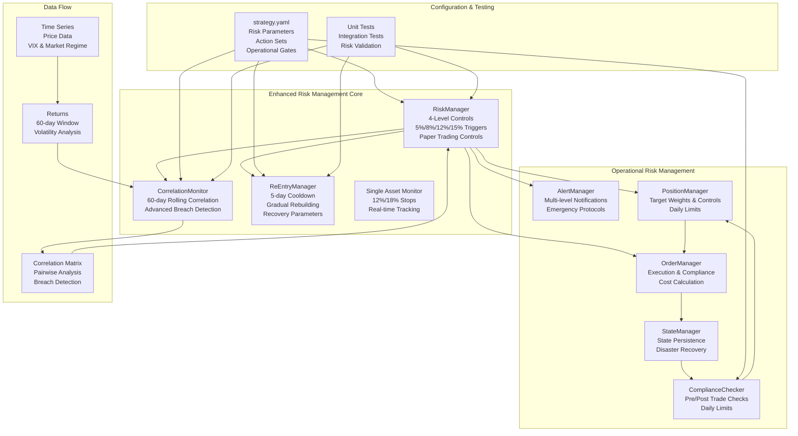
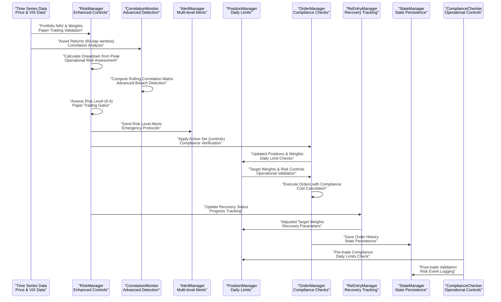
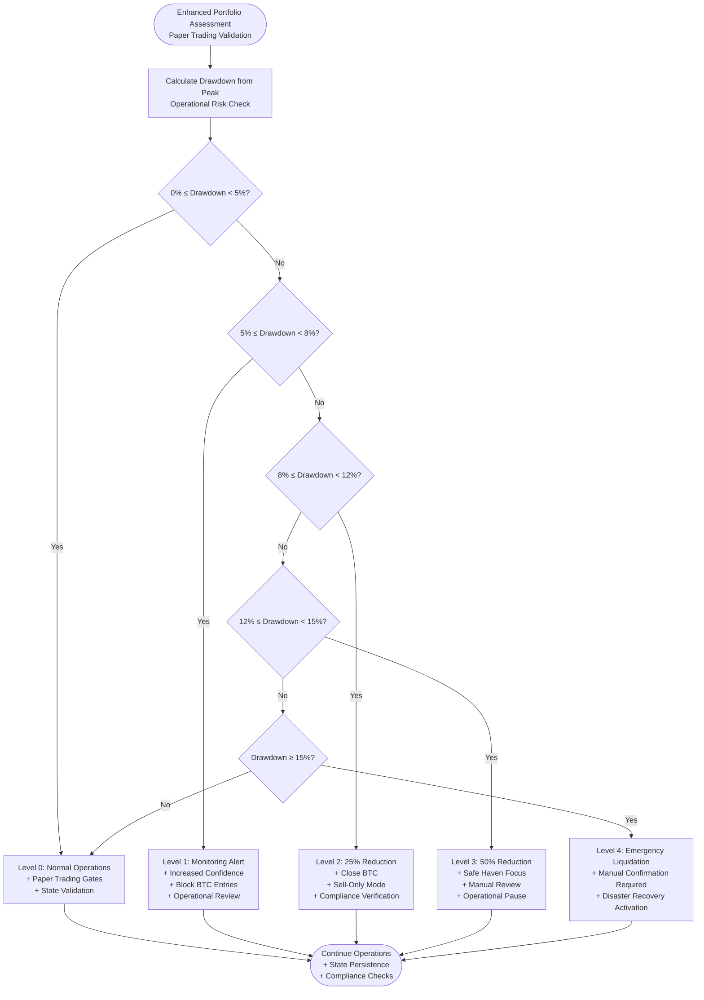
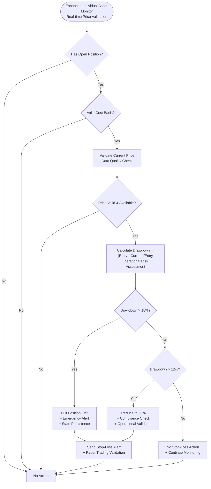
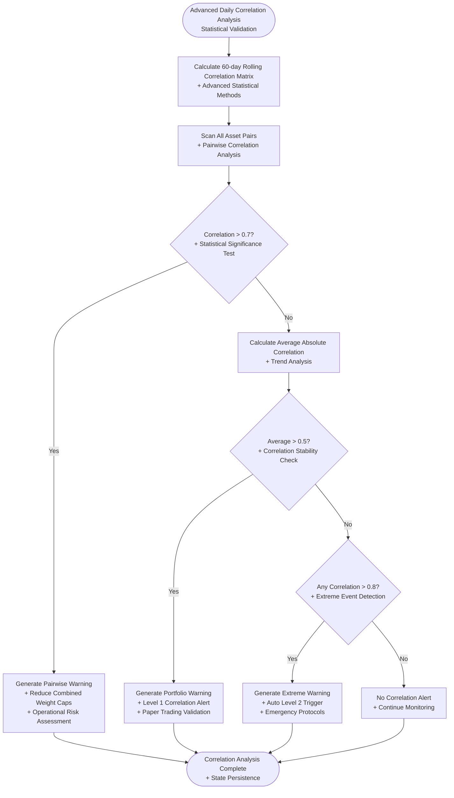
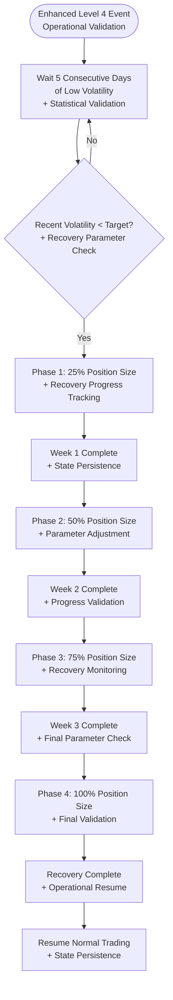
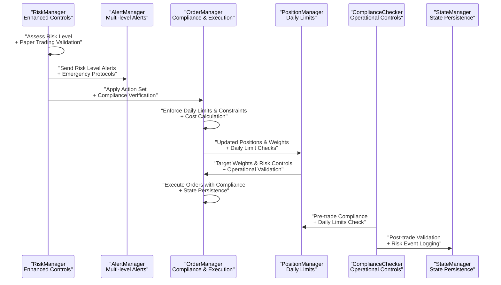
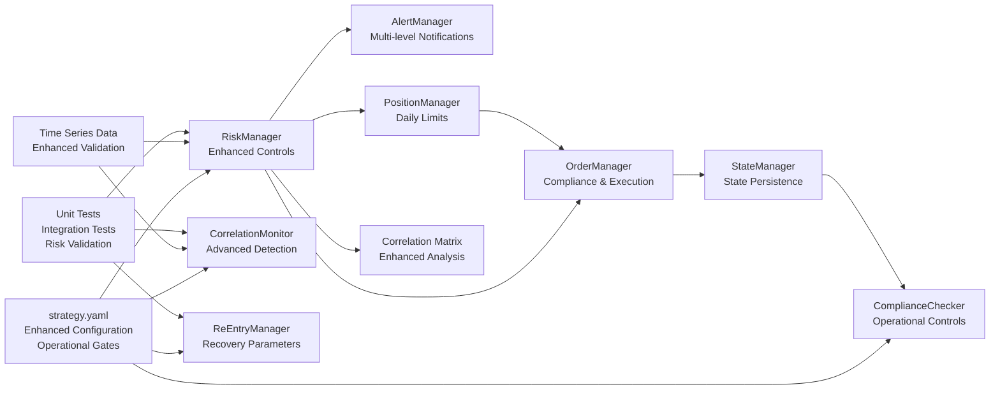

# Risk Management System

<cite>
**Referenced Files in This Document**
- [PRD_Intelligent_Trading_System_v2.md](file://PRD_Intelligent_Trading_System_v2.md)
- [Tech_Design_Document.md](file://Tech_Design_Document.md)
- [src/risk/manager.py](file://src/risk/manager.py)
- [src/risk/correlation.py](file://src/risk/correlation.py)
- [src/risk/reentry.py](file://src/risk/reentry.py)
- [src/models/domain.py](file://src/models/domain.py)
- [src/alerts/manager.py](file://src/alerts/manager.py)
- [src/execution/order_manager.py](file://src/execution/order_manager.py)
- [src/execution/compliance.py](file://src/execution/compliance.py)
- [src/state/manager.py](file://src/state/manager.py)
- [config/strategy.yaml](file://config/strategy.yaml)
- [main.py](file://main.py)
- [tests/test_risk.py](file://tests/test_risk.py)
</cite>

## Update Summary
**Changes Made**
- Enhanced risk management framework for Phases 5-7 with comprehensive paper trading risk controls
- Integrated live trading risk monitoring with operational risk management procedures
- Added systematic operational risk controls including state persistence, compliance checking, and disaster recovery
- Strengthened correlation monitoring with advanced breach detection algorithms
- Improved single asset stop-loss mechanisms with real-time price tracking
- Enhanced re-entry procedures with configurable recovery parameters

## Table of Contents
1. [Introduction](#introduction)
2. [Project Structure](#project-structure)
3. [Core Components](#core-components)
4. [Architecture Overview](#architecture-overview)
5. [Detailed Component Analysis](#detailed-component-analysis)
6. [Dependency Analysis](#dependency-analysis)
7. [Performance Considerations](#performance-considerations)
8. [Troubleshooting Guide](#troubleshooting-guide)
9. [Conclusion](#conclusion)
10. [Appendices](#appendices)

## Introduction
This document describes the complete hierarchical risk management system that replaces a simple hard stop-loss with a sophisticated graduated de-risking architecture. The system implements a four-level risk control framework with precise drawdown thresholds, correlation monitoring, single-asset stop-loss logic, and disciplined recovery protocols. The system now includes enhanced operational risk management controls for both paper trading and live trading environments, featuring comprehensive state persistence, compliance checking, and disaster recovery capabilities.

**Updated** Enhanced with operational risk management framework for Phases 5-7 including paper trading gates, live trading monitoring, and systematic operational safeguards.

## Project Structure
The risk management system is a modular component integrated throughout the trading system with enhanced operational controls. The implementation includes dedicated modules for risk assessment, correlation monitoring, re-entry management, alert notifications, compliance checking, and state persistence, all coordinated through the main trading system orchestration.

```mermaid
graph TB
subgraph "Enhanced Risk Management Core"
RM["RiskManager<br/>4-Level Controls<br/>5%/8%/12%/15% Triggers<br/>Paper Trading Controls"]
CM["CorrelationMonitor<br/>60-day Rolling Correlation<br/>Advanced Breach Detection"]
REM["ReEntryManager<br/>5-day Cooldown<br/>Gradual Rebuilding<br/>Recovery Parameters"]
SAM["Single Asset Monitor<br/>12%/18% Stops<br/>Real-time Tracking"]
end
subgraph "Operational Risk Management"
AM["AlertManager<br/>Multi-level Notifications<br/>Emergency Protocols"]
PM["PositionManager<br/>Target Weights & Controls<br/>Daily Limits"]
OM["OrderManager<br/>Execution & Compliance<br/>Cost Calculation"]
SM["StateManager<br/>State Persistence<br/>Disaster Recovery"]
CC["ComplianceChecker<br/>Pre/Post Trade Checks<br/>Daily Limits"]
end
subgraph "Configuration & Testing"
CFG["strategy.yaml<br/>Risk Parameters<br/>Action Sets<br/>Operational Gates"]
TEST["Unit Tests<br/>Integration Tests<br/>Risk Validation"]
end
subgraph "Data Flow"
TS["Time Series<br/>Price Data<br/>VIX & Market Regime"]
RET["Returns<br/>60-day Window<br/>Volatility Analysis"]
CORR["Correlation Matrix<br/>Pairwise Analysis<br/>Breach Detection"]
end
RM --> AM
RM --> PM
RM --> OM
RM --> CM
RM --> REM
CM --> CORR
CORR --> RM
PM --> OM
OM --> SM
SM --> CC
CC --> PM
CFG --> RM
CFG --> CM
CFG --> REM
CFG --> CC
TEST --> RM
TEST --> CM
TEST --> REM
TS --> RET
RET --> CM
```

**Diagram sources**
- [src/risk/manager.py](file://src/risk/manager.py#L9-L38)
- [src/risk/correlation.py](file://src/risk/correlation.py#L19-L31)
- [src/risk/reentry.py](file://src/risk/reentry.py#L8-L25)
- [src/state/manager.py](file://src/state/manager.py#L13-L21)
- [src/execution/compliance.py](file://src/execution/compliance.py#L8-L20)
- [config/strategy.yaml](file://config/strategy.yaml#L46-L91)

**Section sources**
- [src/risk/manager.py](file://src/risk/manager.py#L9-L38)
- [src/risk/correlation.py](file://src/risk/correlation.py#L19-L31)
- [src/risk/reentry.py](file://src/risk/reentry.py#L8-L25)
- [src/state/manager.py](file://src/state/manager.py#L13-L21)
- [src/execution/compliance.py](file://src/execution/compliance.py#L8-L20)
- [config/strategy.yaml](file://config/strategy.yaml#L46-L91)

## Core Components

### RiskManager - Enhanced Four-Level Hierarchical Controls
Implements the complete four-level risk control system with precise drawdown thresholds and action sets, now enhanced with paper trading operational controls:

- **Level 0 (0-5% drawdown)**: Normal operation with baseline controls, paper trading validation
- **Level 1 (5-8% drawdown)**: Monitoring alert, increased confidence threshold, block new BTC exposure, operational review
- **Level 2 (8-12% drawdown)**: 25% position reduction, BTC closure, sell-only operations, compliance verification
- **Level 3 (12-15% drawdown)**: 50% position reduction, safe-haven focus (GLD, TLT), manual review, operational pause
- **Level 4 (>15% drawdown)**: Emergency liquidation, cash/GLD retention, manual confirmation required, disaster recovery activation

**Updated** Enhanced with paper trading risk controls and operational validation requirements.

### CorrelationMonitor - Advanced Correlation Risk Management
Computes 60-day rolling correlation matrices and detects various correlation risk scenarios with enhanced breach detection:

- **Pairwise correlation > 0.7**: Reduces combined weight caps for affected pairs
- **Average portfolio correlation > 0.5**: Level 1 correlation alert with operational risk assessment
- **Uniform extreme movement > 0.8**: Auto Level 2 correlation-triggered action with emergency protocols
- **Safe haven identification**: Automatic recognition of GLD and TLT as safe assets
- **Advanced detection algorithms**: Enhanced statistical methods for correlation breach identification

**Updated** Improved correlation breach detection with advanced statistical analysis.

### ReEntryManager - Controlled Recovery Protocol
Manages systematic recovery after severe drawdown events with configurable parameters:

- **5-day cooldown period**: Requires consecutive days of low volatility with operational validation
- **Gradual position rebuilding**: 25% → 50% → 75% → 100% over 4 weeks with recovery progress tracking
- **Reduced leverage**: Maximum 1.0x leverage during recovery period with operational risk limits
- **Automatic restart conditions**: Resumes normal trading when volatility targets met with validation checks
- **Recovery parameter configuration**: Configurable cooldown days, position percentages, and leverage limits

**Updated** Enhanced with configurable recovery parameters and progress tracking.

### Single Asset Monitor - Idiosyncratic Risk Protection
Provides individual asset-level stop-loss protection with real-time monitoring:

- **12% drawdown**: Reduce position to 50% of target with operational validation
- **18% drawdown**: Full position exit with emergency protocols
- **Independent triggering**: Operates separately from portfolio-level controls
- **Real-time monitoring**: Continuously tracks individual asset performance with price data validation
- **Asset-specific risk controls**: Configurable stop-loss thresholds per asset

**Updated** Enhanced with real-time price tracking and asset-specific risk controls.

### Operational Risk Management
Systematic operational controls for both paper trading and live trading:

- **State persistence**: Comprehensive portfolio state saving with SQLite database
- **Disaster recovery**: Backup creation and system state restoration
- **Compliance checking**: Pre-trade and post-trade compliance validation
- **Daily limits**: Trade count, turnover, and position concentration limits
- **Emergency protocols**: Systematic response to critical risk events

**New** Comprehensive operational risk management framework for Phases 5-7.

**Section sources**
- [src/risk/manager.py](file://src/risk/manager.py#L9-L38)
- [src/risk/correlation.py](file://src/risk/correlation.py#L19-L31)
- [src/risk/reentry.py](file://src/risk/reentry.py#L8-L25)
- [src/state/manager.py](file://src/state/manager.py#L13-L21)
- [src/execution/compliance.py](file://src/execution/compliance.py#L8-L20)
- [config/strategy.yaml](file://config/strategy.yaml#L74-L91)

## Architecture Overview
The enhanced risk system operates as a central control mechanism that continuously monitors portfolio health and market conditions, automatically applying appropriate risk controls while maintaining system stability and recovery capabilities with comprehensive operational safeguards.

```mermaid
sequenceDiagram
participant TS as "Time Series Data<br/>Price & VIX Data"
participant RM as "RiskManager<br/>Enhanced Controls"
participant CM as "CorrelationMonitor<br/>Advanced Detection"
participant AM as "AlertManager<br/>Multi-level Alerts"
participant PM as "PositionManager<br/>Daily Limits"
participant OM as "OrderManager<br/>Compliance Checks"
participant REM as "ReEntryManager<br/>Recovery Tracking"
participant SM as "StateManager<br/>State Persistence"
participant CC as "ComplianceChecker<br/>Operational Controls"
TS->>RM : "Portfolio NAV & Weights<br/>Paper Trading Validation"
TS->>CM : "Asset Returns (60-day window)<br/>Correlation Analysis"
RM->>RM : "Calculate Drawdown from Peak<br/>Operational Risk Assessment"
CM->>CM : "Compute Rolling Correlation Matrix<br/>Advanced Breach Detection"
RM->>RM : "Assess Risk Level (0-4)<br/>Paper Trading Gates"
RM->>AM : "Send Risk Level Alerts<br/>Emergency Protocols"
RM->>OM : "Apply Action Set (controls)<br/>Compliance Verification"
OM->>PM : "Updated Positions & Weights<br/>Daily Limit Checks"
PM->>OM : "Target Weights & Risk Controls<br/>Operational Validation"
OM->>OM : "Execute Orders with Compliance<br/>Cost Calculation"
RM->>REM : "Update Recovery Status<br/>Progress Tracking"
REM->>PM : "Adjusted Target Weights<br/>Recovery Parameters"
OM->>SM : "Save Order History<br/>State Persistence"
CC->>PM : "Pre-trade Compliance<br/>Daily Limits Check"
CC->>SM : "Post-trade Validation<br/>Risk Event Logging"
```

**Diagram sources**
- [main.py](file://main.py#L101-L200)
- [src/risk/manager.py](file://src/risk/manager.py#L39-L80)
- [src/risk/correlation.py](file://src/risk/correlation.py#L32-L52)
- [src/state/manager.py](file://src/state/manager.py#L91-L131)
- [src/execution/compliance.py](file://src/execution/compliance.py#L26-L58)

## Detailed Component Analysis

### Enhanced Four-Level Progressive De-Risking Architecture

#### Level 1: Monitoring Alert (5-8% drawdown)
- **Triggers**: Portfolio drawdown reaches 5-8%
- **Actions**: 
  - Send monitoring alert with operational validation
  - Increase confidence threshold for new entries
  - Block new BTC exposure
  - Maintain normal trading operations
  - Paper trading validation requirements
- **Duration**: Continuous until drawdown returns below 5%

#### Level 2: Progressive Reduction (8-12% drawdown)
- **Triggers**: Portfolio drawdown reaches 8-12%
- **Actions**:
  - Reduce all positions by 25%
  - Close BTC positions immediately
  - Permit only sell orders and hedging
  - Record reasons for transparency
  - Compliance verification and operational checks
- **Duration**: Until drawdown returns below 8%

#### Level 3: Major Reduction (12-15% drawdown)
- **Triggers**: Portfolio drawdown reaches 12-15%
- **Actions**:
  - Reduce all positions to 50% of target
  - Retain only safe-haven assets (GLD, TLT)
  - Initiate manual review process
  - Implement strict position sizing
  - Operational pause and risk assessment
- **Duration**: Until drawdown returns below 12%

#### Level 4: Emergency Liquidation (>15% drawdown)
- **Triggers**: Portfolio drawdown exceeds 15%
- **Actions**:
  - Liquidate all risky assets immediately
  - Retain cash and GLD (unless GLD itself triggers stop)
  - Require manual confirmation to resume trading
  - Implement emergency recovery protocols
  - Disaster recovery activation
  - System state backup and restoration
- **Duration**: Until manual override and recovery conditions met

```mermaid
flowchart TD
Start(["Enhanced Portfolio Assessment<br/>Paper Trading Validation"]) --> DD["Calculate Drawdown from Peak<br/>Operational Risk Check"]
DD --> Check1{"0% ≤ Drawdown < 5%?"}
Check1 --> |Yes| Level0["Level 0: Normal Operations<br/>+ Paper Trading Gates<br/>+ State Validation"]
Check1 --> |No| Check2{"5% ≤ Drawdown < 8%?"}
Check2 --> |Yes| Level1["Level 1: Monitoring Alert<br/>+ Increased Confidence<br/>+ Block BTC Entries<br/>+ Operational Review"]
Check2 --> |No| Check3{"8% ≤ Drawdown < 12%?"}
Check3 --> |Yes| Level2["Level 2: 25% Reduction<br/>+ Close BTC<br/>+ Sell-Only Mode<br/>+ Compliance Verification"]
Check3 --> |No| Check4{"12% ≤ Drawdown < 15%?"}
Check4 --> |Yes| Level3["Level 3: 50% Reduction<br/>+ Safe Haven Focus<br/>+ Manual Review<br/>+ Operational Pause"]
Check4 --> |No| Check5{"Drawdown ≥ 15%?"}
Check5 --> |Yes| Level4["Level 4: Emergency Liquidation<br/>+ Manual Confirmation Required<br/>+ Disaster Recovery Activation"]
Check5 --> |No| Level0
Level0 --> End(["Continue Operations<br/>+ State Persistence<br/>+ Compliance Checks"])
Level1 --> End
Level2 --> End
Level3 --> End
Level4 --> End
```

**Diagram sources**
- [src/risk/manager.py](file://src/risk/manager.py#L12-L19)
- [config/strategy.yaml](file://config/strategy.yaml#L48-L72)
- [src/state/manager.py](file://src/state/manager.py#L255-L296)

**Section sources**
- [src/risk/manager.py](file://src/risk/manager.py#L12-L19)
- [config/strategy.yaml](file://config/strategy.yaml#L48-L72)
- [src/state/manager.py](file://src/state/manager.py#L255-L296)

### Enhanced Single Asset Stop-Loss Mechanism

The system implements independent stop-loss protection for individual assets with real-time monitoring and operational validation:

#### Stop-Loss Thresholds
- **Partial Stop (12% drawdown)**: Automatically reduce position to 50% of target
- **Full Stop (18% drawdown)**: Immediately exit entire position
- **Independent Operation**: Functions separately from portfolio-level controls
- **Real-time Monitoring**: Continuously tracks individual asset performance
- **Price Validation**: Ensures accurate price data for stop-loss decisions

#### Enhanced Implementation Details

```mermaid
flowchart TD
AssetStart(["Enhanced Individual Asset Monitor<br/>Real-time Price Validation"]) --> CheckPos{"Has Open Position?"}
CheckPos --> |No| AssetEnd["No Action"]
CheckPos --> |Yes| CheckBasis{"Valid Cost Basis?"}
CheckBasis --> |No| AssetEnd
CheckBasis --> |Yes| ValidatePrice["Validate Current Price<br/>Data Quality Check"]
ValidatePrice --> PriceOK{"Price Valid & Available?"}
PriceOK --> |No| AssetEnd
PriceOK --> |Yes| CalcDD["Calculate Drawdown = (Entry - Current)/Entry<br/>Operational Risk Assessment"]
CalcDD --> CheckExit{"Drawdown > 18%?"}
CheckExit --> |Yes| FullExit["Full Position Exit<br/>+ Emergency Alert<br/>+ State Persistence"]
CheckExit --> |No| CheckReduce{"Drawdown > 12%?"}
CheckReduce --> |Yes| PartialExit["Reduce to 50%<br/>+ Compliance Check<br/>+ Operational Validation"]
CheckReduce --> |No| NoAction["No Stop-Loss Action<br/>+ Continue Monitoring"]
FullExit --> Alert["Send Stop-Loss Alert<br/>+ Paper Trading Validation"]
PartialExit --> Alert
NoAction --> AssetEnd
Alert --> AssetEnd
```

**Diagram sources**
- [src/risk/manager.py](file://src/risk/manager.py#L121-L146)
- [src/state/manager.py](file://src/state/manager.py#L176-L212)

**Section sources**
- [src/risk/manager.py](file://src/risk/manager.py#L21-L25)
- [src/risk/manager.py](file://src/risk/manager.py#L121-L146)
- [config/strategy.yaml](file://config/strategy.yaml#L74-L76)

### Advanced Correlation Monitoring and Risk Detection

The correlation monitoring system provides early warning of systemic market risks through advanced statistical analysis with enhanced breach detection:

#### Enhanced Correlation Thresholds
- **Pairwise Warning (0.7)**: Identifies high-correlation asset pairs with operational risk assessment
- **Portfolio Average Warning (0.5)**: Signals broad market correlation with correlation trend analysis
- **Extreme Event (0.8)**: Indicates systemic market stress with emergency protocol activation

#### Advanced Correlation Analysis Process

```mermaid
flowchart TD
CorrStart(["Advanced Daily Correlation Analysis<br/>Statistical Validation"]) --> Calc["Calculate 60-day Rolling Correlation Matrix<br/>+ Advanced Statistical Methods"]
Calc --> Pairs["Scan All Asset Pairs<br/>+ Pairwise Correlation Analysis"]
Pairs --> PairCheck{"Correlation > 0.7?<br/>+ Statistical Significance Test"}
PairCheck --> |Yes| PairAlert["Generate Pairwise Warning<br/>+ Reduce Combined Weight Caps<br/>+ Operational Risk Assessment"]
PairCheck --> |No| AvgCalc["Calculate Average Absolute Correlation<br/>+ Trend Analysis"]
AvgCalc --> AvgCheck{"Average > 0.5?<br/>+ Correlation Stability Check"}
AvgCheck --> |Yes| AvgAlert["Generate Portfolio Warning<br/>+ Level 1 Correlation Alert<br/>+ Paper Trading Validation"]
AvgCheck --> |No| ExtCheck{"Any Correlation > 0.8?<br/>+ Extreme Event Detection"}
ExtCheck --> |Yes| ExtAlert["Generate Extreme Warning<br/>+ Auto Level 2 Trigger<br/>+ Emergency Protocols"]
ExtCheck --> |No| NoAlert["No Correlation Alert<br/>+ Continue Monitoring"]
PairAlert --> CorrEnd(["Correlation Analysis Complete<br/>+ State Persistence"])
AvgAlert --> CorrEnd
ExtAlert --> CorrEnd
NoAlert --> CorrEnd
```

**Diagram sources**
- [src/risk/correlation.py](file://src/risk/correlation.py#L53-L121)
- [src/state/manager.py](file://src/state/manager.py#L255-L296)

**Section sources**
- [src/risk/correlation.py](file://src/risk/correlation.py#L22-L26)
- [src/risk/correlation.py](file://src/risk/correlation.py#L53-L121)
- [config/strategy.yaml](file://config/strategy.yaml#L78-L82)

### Enhanced Re-Entry Procedures and Recovery Protocols

After severe drawdown events, the system implements a controlled recovery process with configurable parameters and progress tracking:

#### Enhanced Recovery Phases
- **Phase 1 (Week 1)**: Start with 25% of normal position size with operational validation
- **Phase 2 (Week 2)**: Increase to 50% of normal position size with progress tracking
- **Phase 3 (Week 3)**: Increase to 75% of normal position size with recovery parameter adjustment
- **Phase 4 (Week 4)**: Return to 100% of normal position size with final validation

#### Enhanced Recovery Requirements
- **5-day Cooldown**: Portfolio volatility must remain below target level with statistical validation
- **Reduced Leverage**: Maximum 1.0x leverage during recovery period with operational risk limits
- **Gradual Rebuilding**: Systematic increase in position sizes with progress monitoring
- **Manual Override**: Final approval required to exit recovery mode with operational review
- **Configurable Parameters**: Adjustable cooldown days, position percentages, and leverage limits

```mermaid
flowchart TD
RecoveryStart(["Enhanced Level 4 Event<br/>Operational Validation"]) --> Cooldown["Wait 5 Consecutive Days<br/>of Low Volatility<br/>+ Statistical Validation"]
Cooldown --> VolCheck{"Recent Volatility < Target?<br/>+ Recovery Parameter Check"}
VolCheck --> |No| Cooldown
VolCheck --> |Yes| Phase1["Phase 1: 25% Position Size<br/>+ Recovery Progress Tracking"]
Phase1 --> Week1["Week 1 Complete<br/>+ State Persistence"]
Week1 --> Phase2["Phase 2: 50% Position Size<br/>+ Parameter Adjustment"]
Phase2 --> Week2["Week 2 Complete<br/>+ Progress Validation"]
Week2 --> Phase3["Phase 3: 75% Position Size<br/>+ Recovery Monitoring"]
Phase3 --> Week3["Week 3 Complete<br/>+ Final Parameter Check"]
Week3 --> Phase4["Phase 4: 100% Position Size<br/>+ Final Validation"]
Phase4 --> Complete["Recovery Complete<br/>+ Operational Resume"]
Complete --> Resume["Resume Normal Trading<br/>+ State Persistence"]
```

**Diagram sources**
- [src/risk/reentry.py](file://src/risk/reentry.py#L26-L55)
- [src/risk/reentry.py](file://src/risk/reentry.py#L57-L78)
- [src/state/manager.py](file://src/state/manager.py#L255-L296)

**Section sources**
- [src/risk/reentry.py](file://src/risk/reentry.py#L11-L17)
- [src/risk/reentry.py](file://src/risk/reentry.py#L26-L55)
- [src/risk/reentry.py](file://src/risk/reentry.py#L57-L78)
- [config/strategy.yaml](file://config/strategy.yaml#L84-L91)

### Enhanced Automated Trigger Mechanisms and Action Sets

The risk system automatically applies appropriate controls based on the current risk level with comprehensive operational validation:

#### Enhanced Action Set Mapping
- **Level 0**: Normal operations, baseline controls, paper trading validation
- **Level 1**: Monitoring alert, confidence threshold increase, BTC exposure block, operational review
- **Level 2**: Position reduction, BTC closure, sell-only operations, compliance verification
- **Level 3**: Major reduction, safe-haven focus, manual review requirement, operational pause
- **Level 4**: Emergency liquidation, manual confirmation requirement, disaster recovery activation

#### Enhanced Integration with Execution and Operational Controls

```mermaid
sequenceDiagram
participant RM as "RiskManager<br/>Enhanced Controls"
participant AM as "AlertManager<br/>Multi-level Alerts"
participant OM as "OrderManager<br/>Compliance & Execution"
participant PM as "PositionManager<br/>Daily Limits"
participant CC as "ComplianceChecker<br/>Operational Controls"
participant SM as "StateManager<br/>State Persistence"
RM->>RM : "Assess Risk Level<br/>+ Paper Trading Validation"
RM->>AM : "Send Risk Level Alerts<br/>+ Emergency Protocols"
RM->>OM : "Apply Action Set<br/>+ Compliance Verification"
OM->>OM : "Enforce Daily Limits & Constraints<br/>+ Cost Calculation"
OM->>PM : "Updated Positions & Weights<br/>+ Daily Limit Checks"
PM->>OM : "Target Weights & Risk Controls<br/>+ Operational Validation"
OM->>OM : "Execute Orders with Compliance<br/>+ State Persistence"
CC->>PM : "Pre-trade Compliance<br/>+ Daily Limits Check"
CC->>SM : "Post-trade Validation<br/>+ Risk Event Logging"
```

**Diagram sources**
- [src/risk/manager.py](file://src/risk/manager.py#L101-L119)
- [src/alerts/manager.py](file://src/alerts/manager.py#L128-L142)
- [src/execution/order_manager.py](file://src/execution/order_manager.py#L29-L85)
- [src/execution/compliance.py](file://src/execution/compliance.py#L26-L58)
- [src/state/manager.py](file://src/state/manager.py#L91-L131)

**Section sources**
- [src/risk/manager.py](file://src/risk/manager.py#L101-L119)
- [src/alerts/manager.py](file://src/alerts/manager.py#L128-L142)
- [src/execution/order_manager.py](file://src/execution/order_manager.py#L29-L85)
- [src/execution/compliance.py](file://src/execution/compliance.py#L26-L58)

### Enhanced Configuration Parameters and Operational Procedures

#### Enhanced Risk Control Configuration
- **Drawdown Thresholds**: 5%, 8%, 12%, 15% with corresponding action sets and operational validation
- **Single Asset Stops**: 12% (partial) and 18% (full) drawdown thresholds with real-time price validation
- **Correlation Parameters**: 0.7 (pairwise), 0.5 (average), 0.8 (extreme) with advanced detection algorithms
- **Recovery Settings**: 5-day cooldown, 25% weekly increases, 1.0x max leverage with configurable parameters
- **Operational Gates**: Paper trading requirements, live trading progression, disaster recovery protocols

#### Enhanced Operational Procedures
- **Risk Assessment**: Daily drawdown calculation from peak NAV with operational validation
- **Action Application**: Automatic execution of appropriate controls with compliance verification
- **Alert Generation**: Multi-level notifications based on risk severity with emergency protocols
- **State Management**: Persistent tracking of risk levels, recovery status, and operational events
- **Compliance Checking**: Pre-trade and post-trade validation with daily limit enforcement
- **Disaster Recovery**: Systematic backup creation and state restoration procedures

**Section sources**
- [config/strategy.yaml](file://config/strategy.yaml#L46-L91)
- [src/models/domain.py](file://src/models/domain.py#L58-L62)
- [src/risk/manager.py](file://src/risk/manager.py#L34-L37)
- [src/state/manager.py](file://src/state/manager.py#L255-L296)

## Dependency Analysis
The enhanced risk management system integrates with all major trading system components through well-defined interfaces and shared configuration with comprehensive operational controls:

```mermaid
graph LR
CFG["strategy.yaml<br/>Enhanced Configuration<br/>Operational Gates"] --> RM["RiskManager<br/>Enhanced Controls"]
CFG --> CM["CorrelationMonitor<br/>Advanced Detection"]
CFG --> REM["ReEntryManager<br/>Recovery Parameters"]
CFG --> CC["ComplianceChecker<br/>Operational Controls"]
RM --> AM["AlertManager<br/>Multi-level Notifications"]
RM --> PM["PositionManager<br/>Daily Limits"]
RM --> OM["OrderManager<br/>Compliance & Execution"]
RM --> CORR["Correlation Matrix<br/>Enhanced Analysis"]
PM --> OM
OM --> SM["StateManager<br/>State Persistence"]
SM --> CC
TS["Time Series Data<br/>Enhanced Validation"] --> CM
TS --> RM
TEST["Unit Tests<br/>Integration Tests<br/>Risk Validation"] --> RM
TEST --> CM
TEST --> REM
```

**Diagram sources**
- [config/strategy.yaml](file://config/strategy.yaml#L46-L91)
- [main.py](file://main.py#L48-L55)
- [src/state/manager.py](file://src/state/manager.py#L13-L21)
- [src/execution/compliance.py](file://src/execution/compliance.py#L8-L20)

**Section sources**
- [config/strategy.yaml](file://config/strategy.yaml#L46-L91)
- [main.py](file://main.py#L48-L55)
- [src/state/manager.py](file://src/state/manager.py#L13-L21)
- [src/execution/compliance.py](file://src/execution/compliance.py#L8-L20)

## Performance Considerations
- **Enhanced Correlation Computation**: Efficient rolling window calculations using pandas rolling operations with advanced statistical validation
- **Risk Assessment**: Single daily evaluation with caching of intermediate results and operational validation
- **Memory Management**: Configurable rolling windows to balance accuracy and memory usage with state persistence
- **Alert Throttling**: Prevents alert flood during rapid risk level changes with operational prioritization
- **Execution Efficiency**: Minimal overhead in normal operations, maximum responsiveness during risk events with compliance verification
- **State Persistence**: Optimized database operations for portfolio state saving and loading with backup procedures
- **Compliance Checking**: Efficient pre-trade and post-trade validation with daily limit enforcement

## Troubleshooting Guide

### Enhanced Common Issues and Solutions

#### Enhanced False Positives in Risk Level Changes
- **Symptom**: Rapid oscillation between risk levels with operational validation failures
- **Cause**: Slight drawdown fluctuations near threshold boundaries with incomplete paper trading validation
- **Solution**: Verify drawdown calculations, ensure proper operational validation, consider smoothing techniques

#### Enhanced Delayed Recovery After Level 4
- **Symptom**: Extended recovery period beyond expectations with recovery parameter issues
- **Cause**: Volatility not meeting recovery criteria consistently with operational gate failures
- **Solution**: Monitor volatility history, adjust recovery parameters, ensure proper operational validation

#### Enhanced Correlation Alert Delays
- **Symptom**: Late detection of correlation risks with statistical validation failures
- **Cause**: 60-day rolling window requires sufficient historical data with correlation analysis issues
- **Solution**: Ensure adequate historical data availability, consider shorter windows for early detection, validate statistical significance

#### Enhanced Single Asset Stop Misfires
- **Symptom**: Premature or delayed stop-loss triggers with price validation errors
- **Cause**: Inaccurate cost basis tracking, price data issues, or operational validation failures
- **Solution**: Verify entry price tracking, ensure real-time price updates, implement price data validation

#### Enhanced Recovery Mode Stuck
- **Symptom**: Unable to exit recovery mode with operational parameter conflicts
- **Cause**: Volatility not meeting recovery criteria consistently with recovery parameter misconfiguration
- **Solution**: Check volatility calculations, adjust recovery parameters, validate operational requirements

#### Enhanced State Persistence Failures
- **Symptom**: Portfolio state not saving/loading correctly with database issues
- **Cause**: Database connection problems, schema mismatches, or backup failures
- **Solution**: Verify database connectivity, check schema integrity, ensure proper backup procedures

#### Enhanced Compliance Violations
- **Symptom**: Frequent compliance check failures with operational rule conflicts
- **Cause**: Daily limit exceeded, position concentration issues, or operational parameter violations
- **Solution**: Monitor daily trading limits, adjust position concentrations, validate operational parameters

**Section sources**
- [src/risk/manager.py](file://src/risk/manager.py#L64-L71)
- [src/risk/reentry.py](file://src/risk/reentry.py#L26-L55)
- [src/state/manager.py](file://src/state/manager.py#L91-L131)
- [src/execution/compliance.py](file://src/execution/compliance.py#L26-L58)

## Conclusion
The enhanced hierarchical risk management system provides comprehensive protection against various market risks through graduated de-risking, correlation-aware controls, and disciplined recovery protocols with systematic operational risk management. The system's four-level architecture ensures appropriate responses to different severity levels while maintaining trading flexibility and capital preservation. The integration of single-asset stop-loss protection, correlation monitoring, systematic recovery procedures, and comprehensive operational controls creates a robust risk management framework suitable for both paper trading and live trading environments across Phases 5-7.

**Updated** Enhanced with comprehensive operational risk management controls for Phases 5-7 including paper trading gates, live trading monitoring, and systematic operational safeguards.

## Appendices

### Enhanced Practical Examples: System Behavior Under Different Market Conditions

#### Enhanced Mild Drawdown (5-8%)
- **Expected Response**: Level 1 monitoring alert with increased confidence thresholds and operational validation
- **Actions**: Block new BTC exposure, maintain normal operations, paper trading validation requirements
- **Duration**: Until drawdown returns below 5%

#### Enhanced Moderate Drawdown (8-12%)
- **Expected Response**: Level 2 progressive reduction (25% position reduction) with compliance verification
- **Actions**: Close BTC positions, permit only sell orders, operational risk assessment
- **Duration**: Until drawdown returns below 8%

#### Enhanced Severe Drawdown (12-15%)
- **Expected Response**: Level 3 major reduction (50% position reduction) with operational pause
- **Actions**: Retain safe-haven assets (GLD, TLT), initiate manual review, operational validation
- **Duration**: Until drawdown returns below 12%

#### Enhanced Extreme Drawdown (>15%)
- **Expected Response**: Level 4 emergency liquidation with disaster recovery activation
- **Actions**: Liquidate risky assets, retain cash/GLD, require manual confirmation, operational safeguards
- **Duration**: Until manual override and recovery conditions met

#### Enhanced High Correlation Environment
- **Pairwise Correlation > 0.7**: Reduced weight caps for affected pairs with statistical validation
- **Average Correlation > 0.5**: Level 1 correlation alert with operational risk assessment
- **Average Correlation > 0.8**: Auto Level 2 correlation-triggered action with emergency protocols

#### Enhanced Operational Risk Scenarios
- **Paper Trading Failure**: Systematic validation failures with operational gate suspension
- **Live Trading Disruption**: Emergency protocols with state persistence and recovery procedures
- **Compliance Violation**: Systematic enforcement with daily limit checks and corrective actions
- **State Persistence Issues**: Backup and recovery procedures with system state restoration

**Section sources**
- [src/risk/manager.py](file://src/risk/manager.py#L12-L19)
- [src/risk/correlation.py](file://src/risk/correlation.py#L74-L121)
- [src/risk/reentry.py](file://src/risk/reentry.py#L26-L55)
- [src/state/manager.py](file://src/state/manager.py#L255-L296)
- [src/execution/compliance.py](file://src/execution/compliance.py#L26-L58)